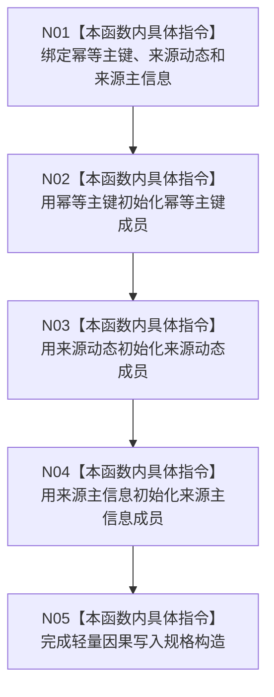

# CF-L9-0127 轻量因果写入规格构造现状流程图

图类型：现状流程图
代码版本：`03a8b7ac099ccea83e57f2696e2290b7bcdfacaf`
当前工作区复核基线：`8632fb891fb3beea255aff1946c07b0fe975ef2b`
源码 blob：`fdc9a1b062b28feffec733dd1a0e342812ef1ddc`
覆盖文件：`海中鱼巣/领域/数据操作.轻量因果.ixx:82-86`
唯一根函数：R0724
完整签名：`海中鱼巣::轻量因果写入规格::轻量因果写入规格(std::uint64_t 幂等主键, 海中鱼巣::节点句柄 来源动态, 海中鱼巣::主信息句柄 来源主信息)`
参数：`幂等主键`、`来源动态`、`来源主信息` 均按值输入
返回结果：构造函数无独立返回值；把三个输入写入对应私有成员并完成对象构造
调用图：`流程图/主程序可达调用关系/01_main可达项目调用边表.md`
逐行映射表：`流程图/代码流程图/L9/CF-L9-0127_轻量因果写入规格构造_逐行代码映射表.md`
输入契约 / 调用语境表：本图“当前边界”节；未另建独立表
非成功返回二分审查表：无分支或显式失败返回；输入合法性由 R0688 在构造前裁决
偏差清单：无 / 不适用；本图只登记当前实现事实
依据提交 / 结构化消息：源码冻结 `03a8b7ac099ccea83e57f2696e2290b7bcdfacaf`；无结构化执行消息
验证输出：配对逐行映射、节点集合、源码 blob 与本批机械审计
已登记调用方：R0688（RCE2143）
直接项目函数：无
外部边界：无
结构读写：只初始化新规格对象的三个成员，不写持久结构
不得作为施工许可：是
不得宣称：构造完成证明输入句柄当前有效，或规格已经提交

## 流程图

## 当前边界

- 本构造函数为 R0688 的私有规格形成路径服务，不自行重复校验主键和句柄。
- 完成对象构造不等于结构写入或事务提交。
