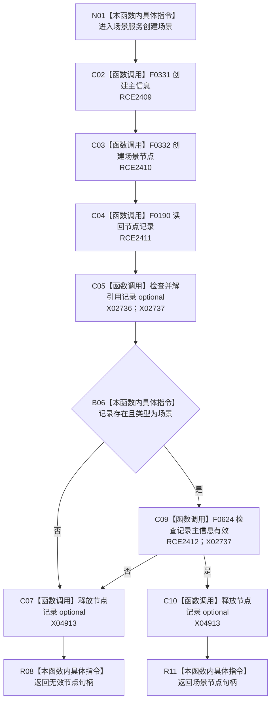

# CF-L9-0128 场景服务创建场景现状流程图

图类型：现状流程图
代码版本：`03a8b7ac099ccea83e57f2696e2290b7bcdfacaf`
当前工作区复核基线：`8632fb891fb3beea255aff1946c07b0fe975ef2b`
源码 blob：`ae4a5c34a3a725f7b2cd53e994ed0bec655a36b5`
覆盖文件：`海中鱼巣/领域/场景服务.h:16-25`
唯一根函数：R0737
完整签名：`海中鱼巣::节点句柄 海中鱼巣::场景服务::创建场景()`
参数：无显式参数；可写使用场景服务持有的主信息仓库与节点仓库引用
返回结果：创建并读回类型与主信息均有效的场景节点时返回其句柄；否则返回无效节点句柄
调用图：`流程图/主程序可达调用关系/00_main可达函数身份表.md`、`01_main可达项目调用边表.md`、`02_main可达外部边界表.md`
已登记调用方：R0734（RCE2405）
直接项目函数：F0331（RCE2409）、F0332（RCE2410）、F0190（RCE2411）、F0624（RCE2412）
外部边界：X02736、X02737、X04913
逐行映射表：`流程图/代码流程图/L9/CF-L9-0128_场景服务创建场景_逐行代码映射表.md`
输入契约 / 调用语境表：本图内嵌审查；由世界服务创建场景入口调用，无显式请求材料
非成功返回二分审查表：创建后的节点记录、类型或主信息读回不符合预期时返回无效句柄，属于追根因解决
偏差清单：补登记节点记录 optional 生命周期 X04913；本函数失败后未在本函数内清理已创建主信息或节点
依据提交 / 结构化消息：冻结源码提交 `03a8b7ac099ccea83e57f2696e2290b7bcdfacaf`、正式稳定边表及顶层稳定 ID 裁决
验证输出：Mermaid / 节点集合 / 逐行覆盖 PASS；目标 no-index 与 strict 检查 PASS；未构建、未运行
不得作为施工许可：是
不得宣称：失败路径已经撤销候选，或场景创建已通过运行验证

## 流程图

## 当前边界

- 本函数按“创建主信息—创建场景节点—读回验证”顺序执行，但读回失败时不在本函数内删除已创建对象。
