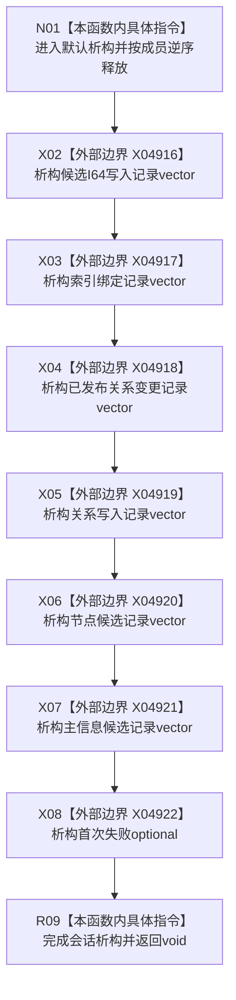

# CF-L9-0129 结构写入会话析构现状流程图

图类型：现状流程图
代码版本：`03a8b7ac099ccea83e57f2696e2290b7bcdfacaf`
当前工作区复核基线：`ef4f7bda76c92c0eb11456cfa267d76f35810616`
源码 blob：`df70de9c299c74f7f0766a3e94facaf504f57968`
覆盖文件：`海中鱼巣/核心/会话.结构写入.ixx:75`
唯一根函数：R0749
完整签名：`海中鱼巣::结构写入会话::~结构写入会话()`
参数：无显式参数；隐式 `this` 指向正在结束生命周期的结构写入会话
返回结果：`void`；默认析构按成员声明逆序释放六个 vector 和一个 optional 成员
调用图：`流程图/主程序可达调用关系/01_main可达项目调用边表.md`
逐行映射表：`流程图/代码流程图/L9/CF-L9-0129_结构写入会话析构_逐行代码映射表.md`
输入契约 / 调用语境表：R0102、R0116 的局部结构写入会话离开作用域时触发；析构前会话决定和阶段由调用路径负责
非成功返回二分审查表：无 / 不适用；析构函数没有状态返回或异常分支
偏差清单：无 / 不适用；本图只登记当前实现事实
依据提交 / 结构化消息：源码冻结 `03a8b7ac099ccea83e57f2696e2290b7bcdfacaf`；X04916—X04922 由顶层图谱维护收口裁决
验证输出：配对逐行映射、节点集合、源码 blob 与本批机械审计
已登记调用方：R0102（RCE2521）、R0116（RCE2524）
直接项目函数：无
外部边界：X04916、X04917、X04918、X04919、X04920、X04921、X04922
结构读写：只释放会话局部容器及其所含对象；不提交、不撤销、不发布，也不写仓库
不得作为施工许可：是
不得宣称：析构会自动提交、撤销未完成事务，或容器释放等于仓库结构回滚

## 流程图

## 当前边界

- 默认析构只体现成员生命周期结束；仓库引用、事务令牌、线程身份、阶段和决定等平凡成员不产生项目调用边。
- vector 元素类型与 `std::thread::id` 的平凡隐式析构不建立项目函数身份。
