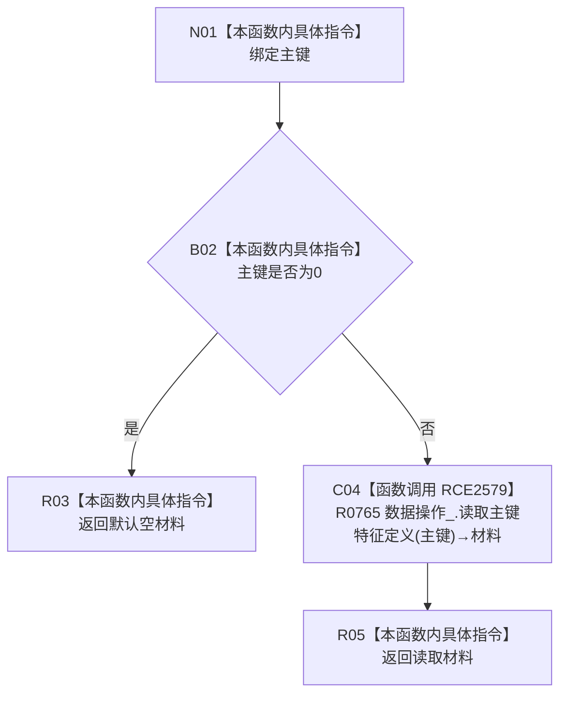

# CF-L9-0130 读取主键特征定义现状流程图

图类型：现状流程图
代码版本：`03a8b7ac099ccea83e57f2696e2290b7bcdfacaf`
当前工作区复核基线：`ef4f7bda76c92c0eb11456cfa267d76f35810616`
源码 blob：`7620a4c6316130cd8af546d69b9528fc696db5c3`
覆盖文件：`海中鱼巣/领域/服务.特征.ixx:237-240`
唯一根函数：R0755
完整签名：`特征定义值式材料 海中鱼巣::特征业务服务::读取主键特征定义(std::uint64_t 主键) const`
参数：`主键` 按值输入；0 为非法入口值
返回结果：主键为 0 时返回默认空材料；否则返回 R0765 的主键特征定义读取结果
已登记调用方：R0233、R0237（RCE2548、RCE2558）
直接项目函数：R0765（RCE2579）
外部边界：无
逐行映射表：`流程图/代码流程图/L9/CF-L9-0130_读取主键特征定义_逐行代码映射表.md`
结构读写：只读主键与特征定义材料，不改变结构
不得作为施工许可：是
不得宣称：非零主键必然存在对应特征定义

## 流程图

## 当前边界

- R0765 只在主键非零分支调用一次。
- 默认空材料只表达当前入口拒绝，不证明仓库读取失败或内部错误。
