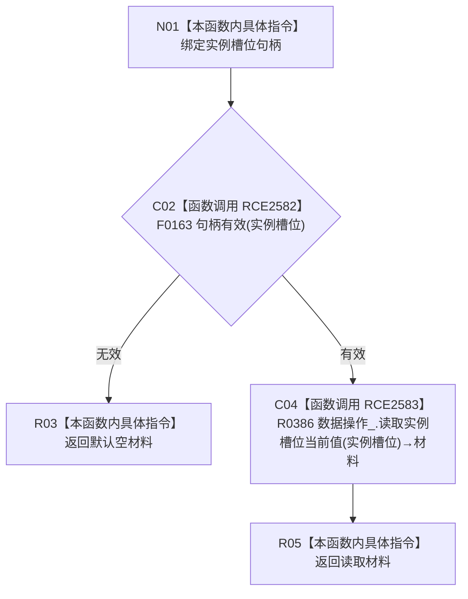

# CF-L9-0132 读取实例槽位当前值现状流程图

图类型：现状流程图
代码版本：`03a8b7ac099ccea83e57f2696e2290b7bcdfacaf`
当前工作区复核基线：`ef4f7bda76c92c0eb11456cfa267d76f35810616`
源码 blob：`7620a4c6316130cd8af546d69b9528fc696db5c3`
覆盖文件：`海中鱼巣/领域/服务.特征.ixx:254-257`
唯一根函数：R0757
完整签名：`特征原始值式材料 海中鱼巣::特征业务服务::读取实例槽位当前值(节点句柄 实例槽位) const`
参数：`实例槽位` 按值输入；无效句柄为非法入口值
返回结果：句柄无效时返回默认空材料；否则返回 R0386 的实例槽位当前值读取结果
已登记调用方：R0233、R0237（RCE2550、RCE2560）
直接项目函数：F0163、R0386（RCE2582、RCE2583）
外部边界：无
逐行映射表：`流程图/代码流程图/L9/CF-L9-0132_读取实例槽位当前值_逐行代码映射表.md`
结构读写：只读句柄与实例槽位当前值材料，不改变结构
不得作为施工许可：是
不得宣称：有效句柄当前必然存在唯一特征值

## 流程图

## 当前边界

- F0163 通过后才调用 R0386；本函数不自行解释当前值状态。
- 默认空材料只表达无效入口的当前返回。
