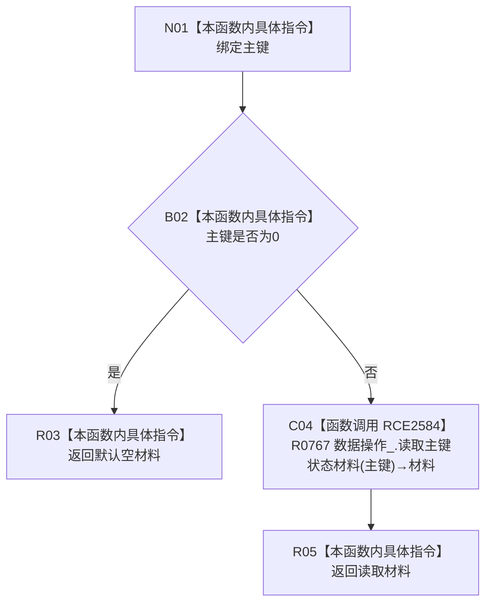

# CF-L9-0133 读取主键状态材料现状流程图

图类型：现状流程图
代码版本：`03a8b7ac099ccea83e57f2696e2290b7bcdfacaf`
当前工作区复核基线：`ef4f7bda76c92c0eb11456cfa267d76f35810616`
源码 blob：`0576315b712424990f8e1c0abd57be681539daf7`
覆盖文件：`海中鱼巣/领域/服务.状态.ixx:148-151`
唯一根函数：R0758
完整签名：`状态值式材料 海中鱼巣::状态业务服务::读取主键状态材料(std::uint64_t 主键) const`
参数：`主键` 按值输入；0 为非法入口值
返回结果：主键为 0 时返回默认空材料；否则返回 R0767 的主键状态材料读取结果
已登记调用方：R0233、R0235、R0237、R0238（RCE2551、RCE2553、RCE2561、RCE2563）
直接项目函数：R0767（RCE2584）
外部边界：无
逐行映射表：`流程图/代码流程图/L9/CF-L9-0133_读取主键状态材料_逐行代码映射表.md`
结构读写：只读主键与状态材料，不改变结构
不得作为施工许可：是
不得宣称：非零主键必然存在对应状态

## 流程图

## 当前边界

- R0767 只在主键非零分支调用一次。
- 本函数不把默认材料提升为仓库内部错误事实。
