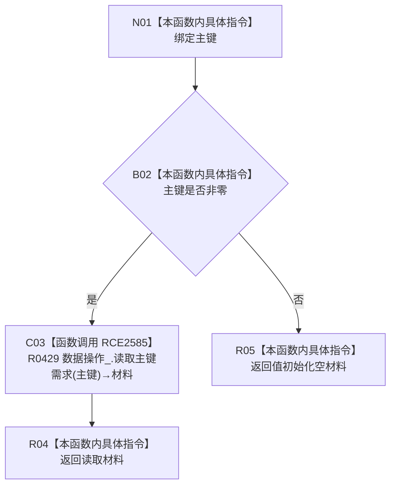

# CF-L9-0134 读取主键需求现状流程图

图类型：现状流程图
代码版本：`03a8b7ac099ccea83e57f2696e2290b7bcdfacaf`
当前工作区复核基线：`ef4f7bda76c92c0eb11456cfa267d76f35810616`
源码 blob：`c56f9fc6c725e59a2d57cd5557326c5887384b4f`
覆盖文件：`海中鱼巣/领域/服务.需求.ixx:222-224`
唯一根函数：R0759
完整签名：`需求权威材料 海中鱼巣::需求业务服务::读取主键需求(std::uint64_t 主键) const`
参数：`主键` 按值输入；0 为非法入口值
返回结果：主键非零时返回 R0429 的主键需求读取结果；主键为 0 时返回值初始化空材料
已登记调用方：R0233、R0237（RCE2552、RCE2562）
直接项目函数：R0429（RCE2585）
外部边界：无
逐行映射表：`流程图/代码流程图/L9/CF-L9-0134_读取主键需求_逐行代码映射表.md`
结构读写：只读主键与需求权威材料，不改变结构
不得作为施工许可：是
不得宣称：非零主键必然命中需求材料

## 流程图

## 当前边界

- 三元表达式保持短路：主键为 0 时不调用 R0429。
- 值初始化空材料只表达当前入口结果。
