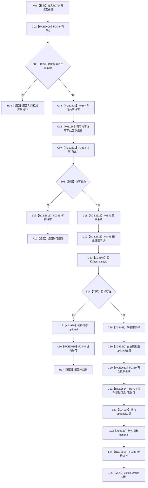

# CF-L9-0135 读取主键基础信息现状流程图

图类型：现状流程图
代码版本：`03a8b7ac099ccea83e57f2696e2290b7bcdfacaf`
当前工作区复核基线：`ef4f7bda76c92c0eb11456cfa267d76f35810616`
源码 blob：`ccde9a574e3817b75e3d02c9c8f88e244327c06a`
覆盖文件：`海中鱼巣/领域/数据操作.语素基础.ixx:248-255`
唯一根函数：R0764
完整签名：`基础信息值式材料 海中鱼巣::语素基础数据操作::读取主键基础信息(std::uint64_t 主键) const`
参数：`主键` 值传递；当前对象只读使用接线与索引
返回结果：入口、许可、索引查找分别返回具名状态；找到时返回 R0774 的基础信息材料
调用图：`流程图/主程序可达调用关系/00_main可达函数身份表.md`、`01_main可达项目调用边表.md`、`02_main可达外部边界表.md`
已登记调用方：R0752、R0783
直接项目函数：F0445、F0397、F0338、F0339、F0441、R0774、F0345（RCE2609—RCE2615）
外部边界：X03166—X03168、X04926—X04928
逐行映射表：`流程图/代码流程图/L9/CF-L9-0135_读取主键基础信息_逐行代码映射表.md`
输入契约 / 调用语境表：本图内嵌审查；调用方按幂等主键读取基础信息
非成功返回二分审查表：本图内嵌审查；无效入口、许可拒绝和未找到均为当前显式结果
偏差清单：无独立文件；本批只记录当前代码事实
依据提交 / 结构化消息：冻结源码提交 `03a8b7ac099ccea83e57f2696e2290b7bcdfacaf`、正式图谱与顶层稳定边裁决
验证输出：Mermaid / 节点集合 / 逐行覆盖 PASS；目标 no-index 检查 PASS；未构建、未运行
不得作为施工许可：是
不得宣称：返回材料已经完成本函数之外的业务验收

## 流程图

## 当前边界

- 共享许可和两个 optional 的生命周期按各自退出路径展开。
