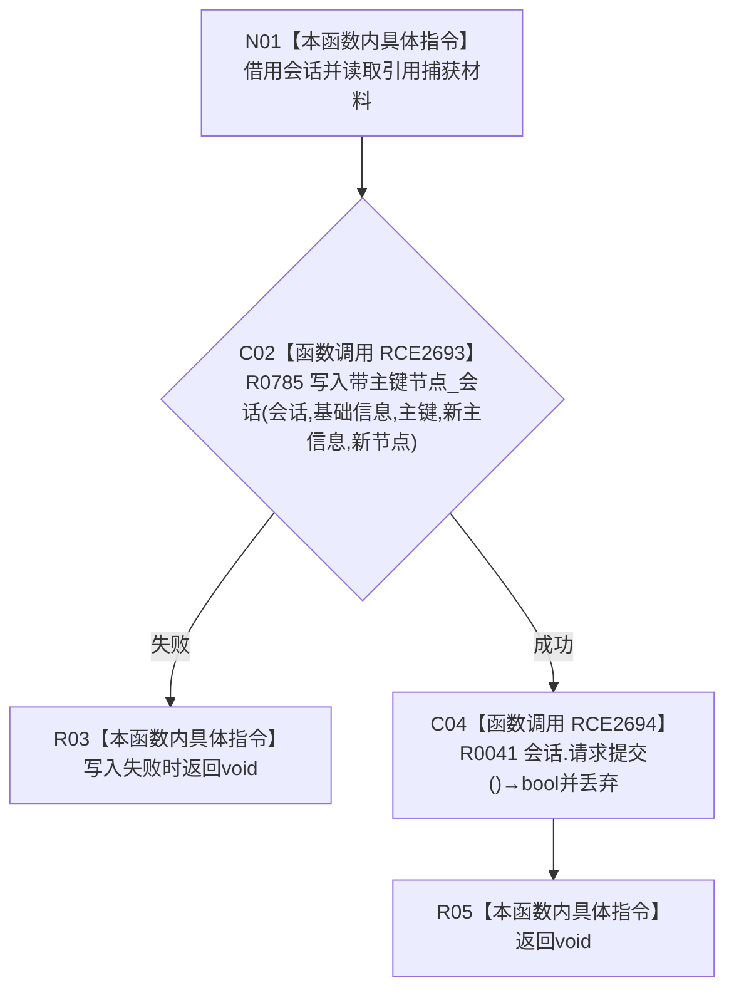

# CF-L9-0136 创建基础信息写入回调现状流程图

图类型：现状流程图
代码版本：`03a8b7ac099ccea83e57f2696e2290b7bcdfacaf`
当前工作区复核基线：`9fda64b1f2330996913d09dd314fc498303d3e54`
源码 blob：`ccde9a574e3817b75e3d02c9c8f88e244327c06a`
覆盖文件：`海中鱼巣/领域/数据操作.语素基础.ixx:340-344`
唯一根函数：R0784
完整签名：`void 海中鱼巣::语素基础数据操作::创建基础信息(std::uint64_t 主键) const::<lambda@数据操作.语素基础.ixx:340>::operator()(海中鱼巣::结构写入会话& 会话) const`
参数：`会话` 以非 const 引用借用；lambda 以引用捕获 `主键`、`新主信息`、`新节点`
返回结果：`void`；写入辅助失败时直接返回，不请求提交；成功时调用 R0041 请求提交并忽略其布尔返回
已登记调用方：R0116（RCE2692；R0783 以 RCB0038 注册同步回调）
直接项目函数：R0785、R0041（RCE2693、RCE2694）
外部边界：无
逐行映射表：`流程图/代码流程图/L9/CF-L9-0136_创建基础信息写入回调_逐行代码映射表.md`
结构读写：经会话候选接口创建并绑定基础信息节点；成功时请求执行器提交会话
不得作为施工许可：是
不得宣称：请求提交返回值被本回调检查，或回调返回代表事务已经提交

## 流程图

## 当前边界

- 回调由 R0116 同步调用；`std::function` 包装生命周期归属于 R0783 的 X03210/X03211。
- R0041 的布尔返回被显式转为 `void`，本回调不据此改变控制分支。
