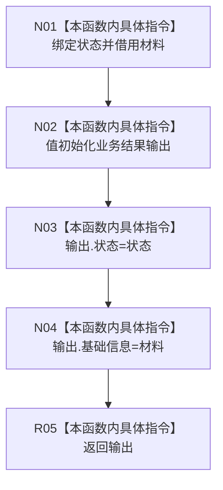

# CF-L9-0137 形成基础信息结果现状流程图

图类型：现状流程图
代码版本：`03a8b7ac099ccea83e57f2696e2290b7bcdfacaf`
当前工作区复核基线：`9fda64b1f2330996913d09dd314fc498303d3e54`
源码 blob：`ccde9a574e3817b75e3d02c9c8f88e244327c06a`
覆盖文件：`海中鱼巣/领域/数据操作.语素基础.ixx:736-743`
唯一根函数：R0786
完整签名：`static 语义基础业务结果 海中鱼巣::语素基础数据操作::形成基础信息结果(语义基础业务状态 状态, const 基础信息值式材料& 材料)`
参数：`状态` 按值输入；`材料` 以 const 引用借用
返回结果：返回状态和基础信息材料均来自实参的值式业务结果
已登记调用方：R0783（RCE2688，源码两处调用点）
直接项目函数：无
外部边界：无
逐行映射表：`流程图/代码流程图/L9/CF-L9-0137_形成基础信息结果_逐行代码映射表.md`
结构读写：只构造局部值式结果，不改变机器结构
不得作为施工许可：是
不得宣称：传入状态与材料彼此一致或材料已经重新读回验证

## 流程图

## 当前边界

- `基础信息值式材料` 使用编译器生成的值式赋值，不建立独立项目函数身份。
- 本函数不调用 `完整()`，不修改输入材料。
