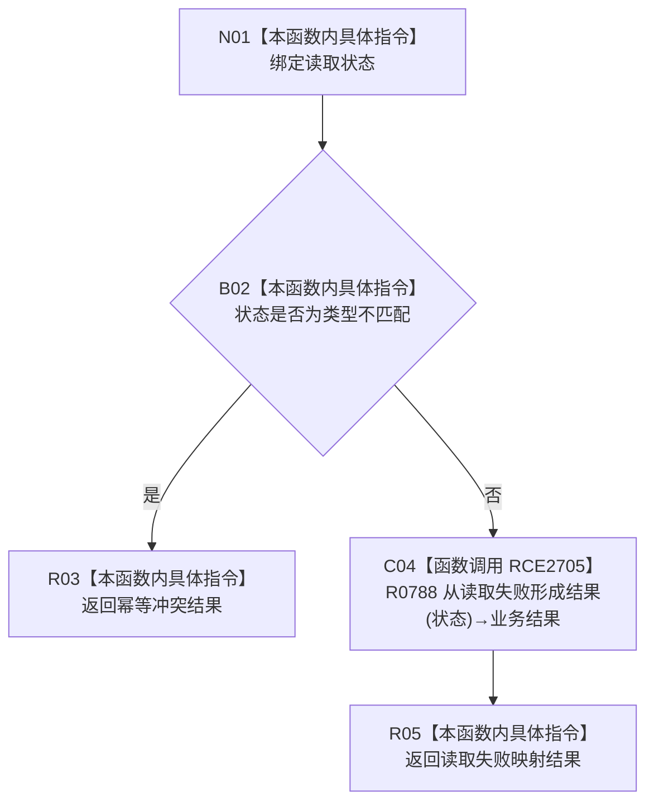

# CF-L9-0138 从读取冲突形成结果现状流程图

图类型：现状流程图
代码版本：`03a8b7ac099ccea83e57f2696e2290b7bcdfacaf`
当前工作区复核基线：`9fda64b1f2330996913d09dd314fc498303d3e54`
源码 blob：`ccde9a574e3817b75e3d02c9c8f88e244327c06a`
覆盖文件：`海中鱼巣/领域/数据操作.语素基础.ixx:779-784`
唯一根函数：R0787
完整签名：`static 语义基础业务结果 海中鱼巣::语素基础数据操作::从读取冲突形成结果(语义基础读取状态 状态) noexcept`
参数：`状态` 按值输入
返回结果：类型不匹配映射为幂等冲突；其它读取状态委托 R0788 映射为业务结果
已登记调用方：R0783（RCE2689）
直接项目函数：R0788（RCE2705）
外部边界：无
逐行映射表：`流程图/代码流程图/L9/CF-L9-0138_从读取冲突形成结果_逐行代码映射表.md`
结构读写：只形成值式业务结果，不改变结构
不得作为施工许可：是
不得宣称：任意读取失败都属于幂等冲突

## 流程图

## 当前边界

- 类型不匹配在本函数直接映射；其余状态的具体映射由 R0788 独立承担。
- 枚举比较为内建运算，不形成项目调用边。
