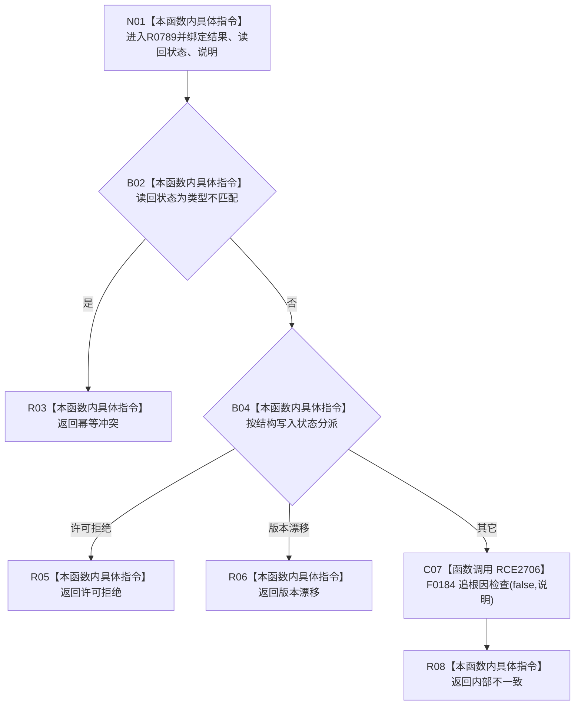

# CF-L9-0139 映射结构失败现状流程图

图类型：现状流程图
代码版本：`03a8b7ac099ccea83e57f2696e2290b7bcdfacaf`
当前工作区复核基线：`9fda64b1f2330996913d09dd314fc498303d3e54`
源码 blob：`ccde9a574e3817b75e3d02c9c8f88e244327c06a`
覆盖文件：`海中鱼巣/领域/数据操作.语素基础.ixx:786-802`
唯一根函数：R0789
完整签名：`static 语义基础业务结果 海中鱼巣::语素基础数据操作::映射结构失败(const 结构写入结果& 结果, 语义基础读取状态 读回状态, const wchar_t* 说明)`
参数：`结果` 只读引用；`读回状态` 值传递；`说明` 为借用宽字符串指针
返回结果：类型不匹配映射幂等冲突；结构许可拒绝或版本漂移映射同名状态；其它调用追根因并返回内部不一致
调用图：`流程图/主程序可达调用关系/00_main可达函数身份表.md`、`01_main可达项目调用边表.md`、`02_main可达外部边界表.md`
已登记调用方：R0783
直接项目函数：F0184（RCE2706）
外部边界：无
逐行映射表：`流程图/代码流程图/L9/CF-L9-0139_映射结构失败_逐行代码映射表.md`
输入契约 / 调用语境表：本图内嵌审查；结构写入失败后形成业务结果
非成功返回二分审查表：本图内嵌审查；默认结构失败在追根因检查后分类为内部不一致
偏差清单：无独立文件；本批只记录当前代码事实
依据提交 / 结构化消息：冻结源码提交 `03a8b7ac099ccea83e57f2696e2290b7bcdfacaf`、正式图谱与顶层稳定 ID 裁决
验证输出：Mermaid / 节点集合 / 逐行覆盖 PASS；目标 no-index 检查 PASS；未构建、未运行
不得作为施工许可：是
不得宣称：返回业务状态已经修复结构失败

## 流程图

## 当前边界

- 本函数不改变结构，只分类现有结果并在默认分支调用诊断性追根因检查。
