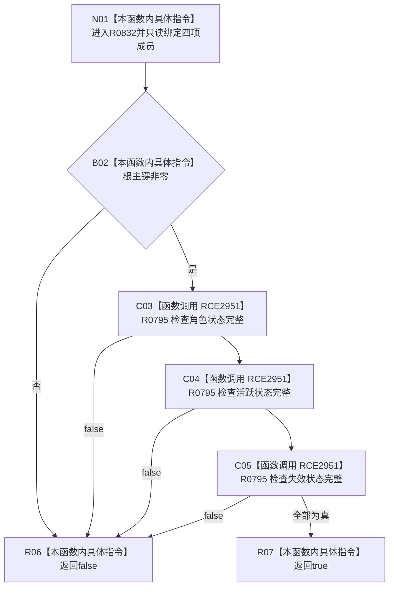

# CF-L9-0140 方法登记根写入规格完整现状流程图

图类型：现状流程图
代码版本：`03a8b7ac099ccea83e57f2696e2290b7bcdfacaf`
当前工作区复核基线：`4e0ac10ae3b18404ff2b623faa0fb006fa0fc7a1`
源码 blob：`16ac9534baeda26ac8a712066e713f3339f6e0c8`
覆盖文件：`海中鱼巣/领域/数据操作.需求任务方法.ixx:692-695`
唯一根函数：R0832
完整签名：`bool 海中鱼巣::方法登记根写入规格::完整() const noexcept`
参数：无显式参数；只读根主键和三个状态写入规格
返回结果：根主键非零且三个状态写入规格均完整时返回 true，否则 false
调用图：`流程图/主程序可达调用关系/00_main可达函数身份表.md`、`01_main可达项目调用边表.md`、`02_main可达外部边界表.md`
已登记调用方：R0427、R0432
直接项目函数：R0795（RCE2951，三次）
外部边界：无
逐行映射表：`流程图/代码流程图/L9/CF-L9-0140_方法登记根写入规格完整_逐行代码映射表.md`
不得作为施工许可：是
不得宣称：规格完整证明状态已经写入或发布

## 流程图

## 当前边界

- 本函数只组合值式规格完整性，不访问仓库。
