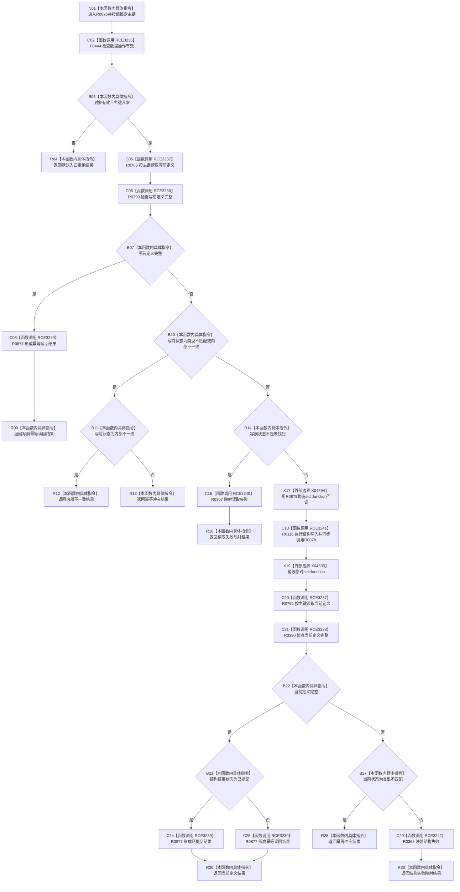

# CF-L9-0141 创建特征定义现状流程图

图类型：现状流程图
代码版本：`03a8b7ac099ccea83e57f2696e2290b7bcdfacaf`
当前工作区复核基线：`00d917a5cf09998d2ab14d9239e1c194b5593ff0`
源码 blob：`a47cd9b07794d30abc6cb9d1df319056105cd596`
覆盖文件：`海中鱼巣/领域/数据操作.特征体系.ixx:691-719`
唯一根函数：R0876
完整签名：`海中鱼巣::特征体系业务结果 海中鱼巣::特征体系数据操作::创建特征定义(std::uint64_t 主键) const`
参数：`主键` 按值传入；函数只读数据操作对象，结构写入由 R0116 承载
返回结果：返回入口拒绝、幂等读回、幂等冲突、内部不一致、已提交或结构失败映射后的特征体系业务结果
调用图：`流程图/主程序可达调用关系/00_main可达函数身份表.md`、`01_main可达项目调用边表.md`、`02_main可达外部边界表.md`
已登记调用方：R0501（RCE3116）
直接项目函数：F0444（RCE3236）、R0765（RCE3237）、R0390（RCE3238）、R0877（RCE3239，两处）、R0367（RCE3240）、R0116（RCE3241）、R0368（RCE3242）
外部边界：X04594、X04595
逐行映射表：`流程图/代码流程图/L9/CF-L9-0141_创建特征定义_逐行代码映射表.md`
输入契约 / 调用语境表：不适用；本批只维护当前代码图谱
非成功返回二分审查表：不适用；返回分支只按当前代码语义标注
偏差清单：不适用；未在本图裁决规范偏差
依据提交 / 结构化消息：当前正式制图队列与三份 main 可达关系表
验证输出：691—719 行逐行覆盖；7 条直接项目边和 2 个外部边界可反查
不得作为施工许可：是
不得宣称：特征定义已经创建、已提交或业务能力已经闭环

## 流程图

## 当前边界

- R0878 的回调正文有独立单函数图；本图只记录回调包装、R0116 调度和包装生命周期。
- 本函数在写后总是读回当前定义；是否返回已提交由读回完整性和结构结果共同决定。
