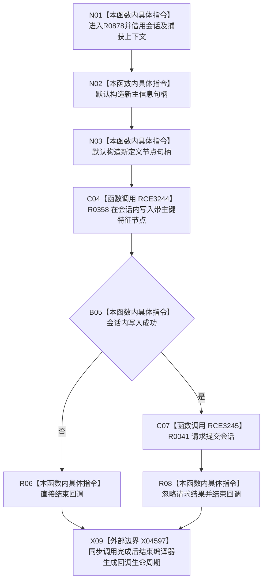

# CF-L9-0142 创建特征定义结构写入回调现状流程图

图类型：现状流程图
代码版本：`03a8b7ac099ccea83e57f2696e2290b7bcdfacaf`
当前工作区复核基线：`00d917a5cf09998d2ab14d9239e1c194b5593ff0`
源码 blob：`a47cd9b07794d30abc6cb9d1df319056105cd596`
覆盖文件：`海中鱼巣/领域/数据操作.特征体系.ixx:702-707`
唯一根函数：R0878
完整签名：`void 海中鱼巣::特征体系数据操作::创建特征定义(std::uint64_t) const::<lambda@数据操作.特征体系.ixx:702>::operator()(海中鱼巣::结构写入会话& 会话) const`
参数：`会话` 为非拥有可写引用；闭包按引用捕获主键及数据操作对象上下文，生命周期限于 R0116 同步调用
返回结果：无返回值；写入失败时直接结束回调，写入成功时请求会话提交
调用图：正式 main 可达关系表
已登记调用方：R0116（RCE3243）
直接项目函数：R0358（RCE3244）、R0041（RCE3245）
外部边界：X04597
逐行映射表：`流程图/代码流程图/L9/CF-L9-0142_创建特征定义结构写入回调_逐行代码映射表.md`
输入契约 / 调用语境表：不适用；本批只维护当前代码图谱
非成功返回二分审查表：不适用；仅标注写入失败早退
偏差清单：不适用；未在本图裁决规范偏差
依据提交 / 结构化消息：当前正式制图队列与三份 main 可达关系表
验证输出：702—707 行逐行覆盖；2 条项目边和 1 个编译器生命周期边界可反查
不得作为施工许可：是
不得宣称：请求提交证明结构已经提交或定义已经可读

## 流程图

## 当前边界

- R0358 失败时不请求提交；结构写入是否撤销和最终状态由 R0116 的会话执行路径决定。
- X04597 是正式外部边界表登记的编译器生成回调生命周期，不代表 operator() 正文显式调用析构函数。
