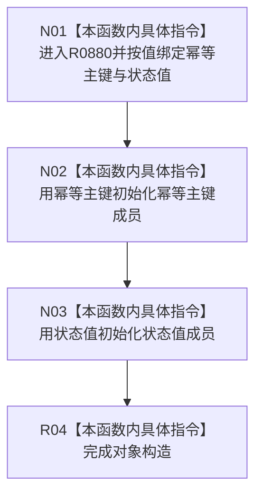

# CF-L9-0143 抽象状态写入规格构造现状流程图

图类型：现状流程图
代码版本：`03a8b7ac099ccea83e57f2696e2290b7bcdfacaf`
当前工作区复核基线：`00d917a5cf09998d2ab14d9239e1c194b5593ff0`
源码 blob：`cc399ea69282bf3ae0b0d59c7f0b587e5164b187`
覆盖文件：`海中鱼巣/领域/数据操作.状态动态.ixx:216-218`
唯一根函数：R0880
完整签名：`海中鱼巣::抽象状态写入规格::抽象状态写入规格(std::uint64_t 幂等主键, std::int64_t 状态值)`
参数：`幂等主键` 和 `状态值` 均按值传入
返回结果：完成一个抽象状态写入规格对象的构造；无独立返回值
调用图：正式 main 可达关系表
已登记调用方：R0879（RCE3253）
直接项目函数：无
外部边界：无
逐行映射表：`流程图/代码流程图/L9/CF-L9-0143_抽象状态写入规格构造_逐行代码映射表.md`
输入契约 / 调用语境表：不适用；本批只维护当前代码图谱
非成功返回二分审查表：不适用；构造函数无分支
偏差清单：不适用；未在本图裁决规范偏差
依据提交 / 结构化消息：当前正式制图队列与三份 main 可达关系表
验证输出：216—218 行逐行覆盖；无出向调用边
不得作为施工许可：是
不得宣称：对象构造证明规格完整或状态已经写入

## 流程图

## 当前边界

- 本构造函数不检查幂等主键是否非零；完整性由 R0795 另行判断。
