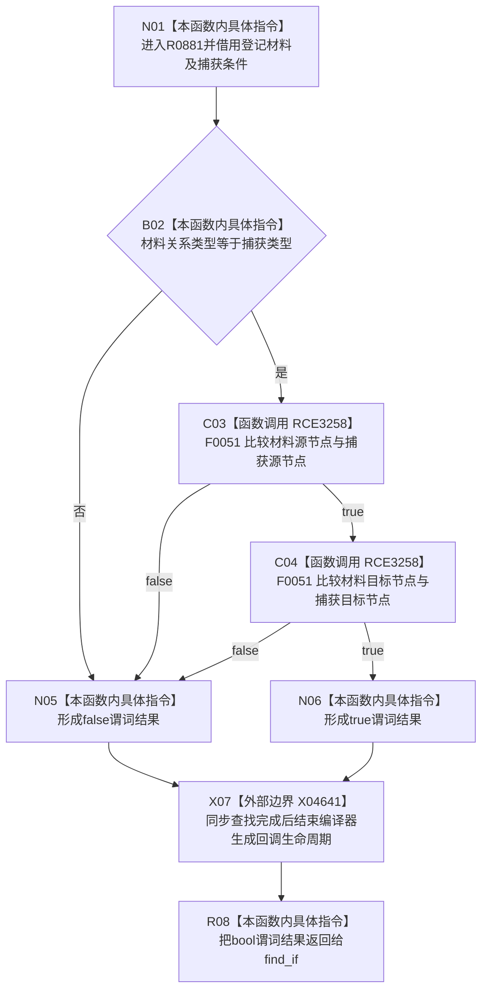

# CF-L9-0144 专用关系登记匹配谓词现状流程图

图类型：现状流程图
代码版本：`03a8b7ac099ccea83e57f2696e2290b7bcdfacaf`
当前工作区复核基线：`00d917a5cf09998d2ab14d9239e1c194b5593ff0`
源码 blob：`dc4bd08f99622b3380c91dd15258fc8ab2e1b9c6`
覆盖文件：`海中鱼巣/领域/概念图服务.h:3938-3940`
唯一根函数：R0881
完整签名：`bool 海中鱼巣::概念图服务::确保专用关系_已加锁(关系类型, 节点句柄, 节点句柄)::<lambda@概念图服务.h:3938>::operator()(const 海中鱼巣::概念图清理准备包::专用关系登记材料& 材料) const`
参数：`材料` 为只读借用；闭包按值捕获关系类型，按引用捕获源节点和目标节点，供 `std::find_if` 同步调用
返回结果：材料的类型、源节点和目标节点全部匹配捕获条件时返回 true，否则 false
调用图：正式 main 可达关系表
已登记调用方：R0524（RCE3257）
直接项目函数：F0051（RCE3258，两处）
外部边界：X04641
逐行映射表：`流程图/代码流程图/L9/CF-L9-0144_专用关系登记匹配谓词_逐行代码映射表.md`
输入契约 / 调用语境表：不适用；本批只维护当前代码图谱
非成功返回二分审查表：不适用；false 仅表示当前登记材料不匹配
偏差清单：不适用；未在本图裁决规范偏差
依据提交 / 结构化消息：当前正式制图队列与三份 main 可达关系表
验证输出：3938—3940 行逐行覆盖；1 条项目边（两处调用）和 1 个编译器生命周期边界可反查
不得作为施工许可：是
不得宣称：谓词命中证明仓库关系存在、有效或已经读回

## 流程图

## 当前边界

- 三项比较按 `&&` 短路；前项为 false 时不会执行后续节点句柄比较。
- X04641 是正式外部边界表登记的编译器生成回调生命周期，不代表 operator() 正文显式调用析构函数。
