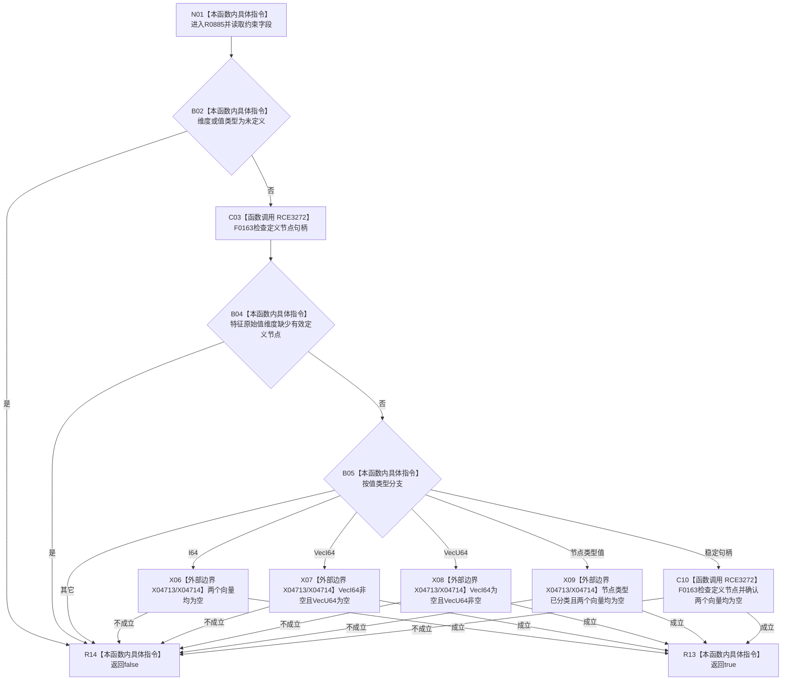

# CF-L9-0145 概念约束材料完整现状流程图

图类型：现状流程图
代码版本：`03a8b7ac099ccea83e57f2696e2290b7bcdfacaf`
当前工作区复核基线：`00d917a5cf09998d2ab14d9239e1c194b5593ff0`
源码 blob：`31c9794099a8fc191c3d5d9369010c52cd863039`
覆盖文件：`海中鱼巣/领域/概念图算法.h:59-81`
唯一根函数：R0885
完整签名：`bool 海中鱼巣::概念约束材料::完整() const`
参数：无显式参数；只读当前概念约束材料
返回结果：维度、值类型、定义节点和对应值载荷组合满足当前分支合同则返回 true，否则 false
调用图：正式 main 可达关系表
已登记调用方：R0884（RCE3271）
直接项目函数：F0163（RCE3272）
外部边界：X04713、X04714
逐行映射表：`流程图/代码流程图/L9/CF-L9-0145_概念约束材料完整_逐行代码映射表.md`
不得作为施工许可：是
不得宣称：true 证明该约束适用于某个具名概念签名

## 流程图

## 当前边界

- I64 分支不检查 `I64值` 的具体数值；完整性只约束值类型与互斥向量载荷。
