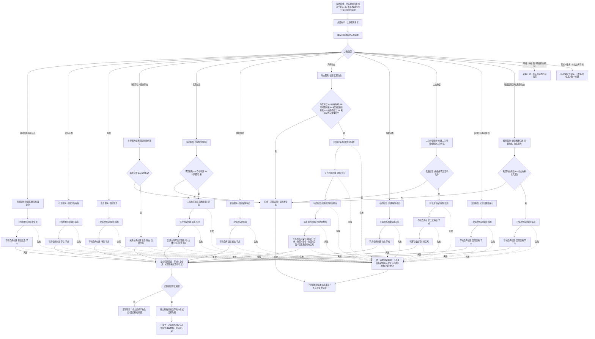

# 基础信息入账代码逻辑现状流程图

更新时间：2026-07-11

## 元数据

```text
图类型：现状流程图
对应施工流程图：流程图/20260708_基础信息入账代码逻辑流程图_v0.1.md
代码版本：3f08239；基于当前脏工作区
实现状态：已实现或已形成第一轮入口
覆盖文件：海中鱼巣/领域/世界服务.h、海中鱼巣/领域/动态服务.h、海中鱼巣/领域/因果服务.h、海中鱼巣/领域/场景服务.h、海中鱼巣/领域/存在服务.h、海中鱼巣/领域/状态服务.h
覆盖函数：世界服务::创建基础信息、存在服务::创建实际存在、场景服务::创建场景、状态服务::创建实例状态、状态服务::创建抽象状态、动态服务::记录实例动态、动态服务::创建抽象动态、因果服务::记录因果引用
逐行映射表：实施记录/现状流程图核查/20260711_基础信息入账代码逻辑现状流程图_v0.1配套核查表.md 第 2 节
输入契约 / 调用语境表：实施记录/现状流程图核查/20260711_基础信息入账代码逻辑现状流程图_v0.1配套核查表.md 第 3 节
非成功返回二分审查表：实施记录/现状流程图核查/20260711_基础信息入账代码逻辑现状流程图_v0.1配套核查表.md 第 4 节
偏差清单：实施记录/现状流程图核查/20260711_基础信息入账代码逻辑现状流程图_v0.1配套核查表.md 第 5 节
不得作为施工许可：是
不得宣称：未匹配节点、未来候选或施工目标已经实现
```

## 现状说明

当前代码存在对应入口；完成范围仍以实施记录和现状边界为准。
本图与根目录施工图并存；施工图回答准备怎样实现，本图只回答当前代码实际存在什么入口和边界。

## 流程图



## 完成边界

本图是当前代码证据基线，不是代码实施许可。当前存在未提交代码时，只能解释为当前工作区事实；未实现和部分实现节点不得扩大为系统完成。
