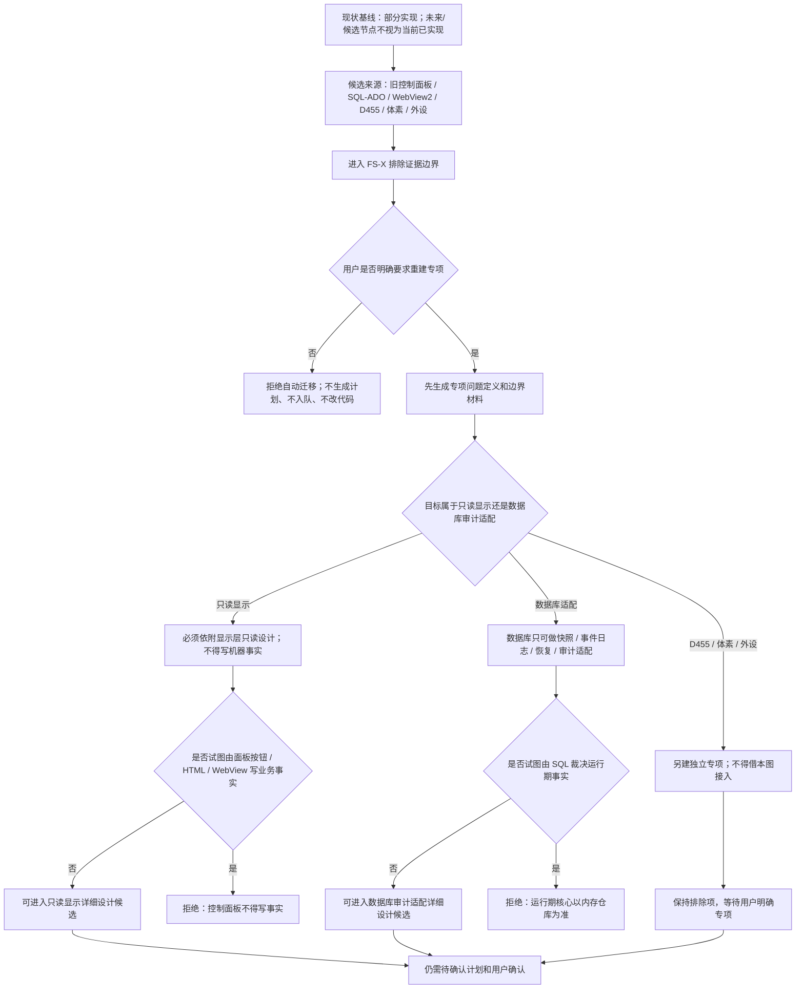

# 控制面板数据库重建候选代码逻辑现状流程图

更新时间：2026-07-11

## 元数据

```text
图类型：现状流程图
对应施工流程图：流程图/20260708_控制面板数据库重建候选代码逻辑流程图_v0.1.md
代码版本：3f08239；基于当前脏工作区
实现状态：部分实现
覆盖文件：海中鱼巣/适配/SQL数据库适配.h、海中鱼巣/领域/控制面板服务.h
覆盖函数：当前无可匹配正式入口
逐行映射表：实施记录/现状流程图核查/20260711_控制面板数据库重建候选代码逻辑现状流程图_v0.1配套核查表.md 第 2 节
输入契约 / 调用语境表：实施记录/现状流程图核查/20260711_控制面板数据库重建候选代码逻辑现状流程图_v0.1配套核查表.md 第 3 节
非成功返回二分审查表：实施记录/现状流程图核查/20260711_控制面板数据库重建候选代码逻辑现状流程图_v0.1配套核查表.md 第 4 节
偏差清单：实施记录/现状流程图核查/20260711_控制面板数据库重建候选代码逻辑现状流程图_v0.1配套核查表.md 第 5 节
不得作为施工许可：是
不得宣称：未匹配节点、未来候选或施工目标已经实现
```

## 现状说明

当前代码只覆盖施工图中的一部分，图内未来节点继续作为缺口。
本图与根目录施工图并存；施工图回答准备怎样实现，本图只回答当前代码实际存在什么入口和边界。

## 流程图



## 完成边界

本图是当前代码证据基线，不是代码实施许可。当前存在未提交代码时，只能解释为当前工作区事实；未实现和部分实现节点不得扩大为系统完成。
