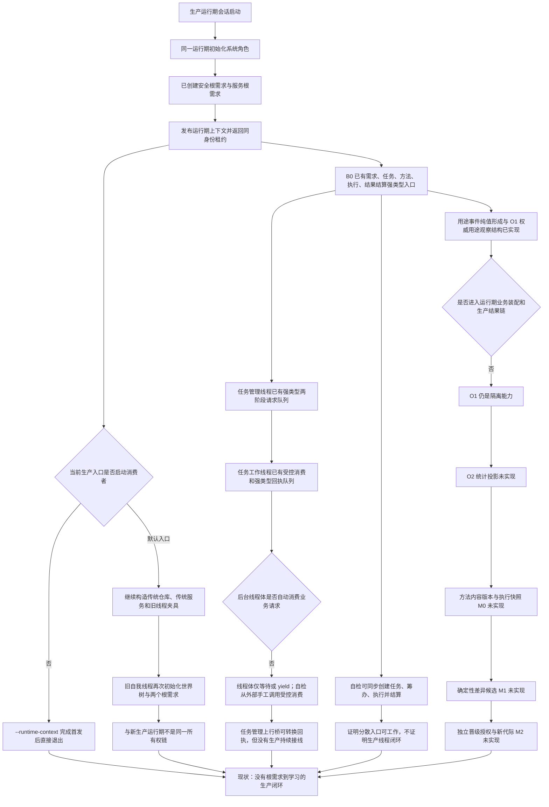

# 根需求任务筹办执行学习闭环现状流程图

更新时间：2026-07-19

## 元数据

```text
图类型：现状流程图
代码版本：main@dcfbb12eb90326a7136ede2d416c0bee6955f963
实现状态：根需求、任务筹办、执行、回执结算和 O1 分别存在；默认生产闭环与学习后半链未形成
覆盖文件：
  海中鱼巣/启动.生产运行期.ixx
  海中鱼巣/启动.运行期上下文.ixx
  海中鱼巣/装配.运行期业务.ixx
  海中鱼巣/领域/组合.运行期业务操作.ixx
  海中鱼巣/线程/任务管理线程.ixx
  海中鱼巣/线程/任务工作线程.ixx
  海中鱼巣/线程/任务管理上行桥.ixx
  海中鱼巣/线程/自我线程.ixx
  海中鱼巣/领域/服务.用途观察.ixx
  海中鱼巣/入口.cpp
逐行映射表：项目记忆/设计记录/20260719_REAL-LOOP-S0_根需求任务筹办执行学习逐行代码映射表.md
输入契约 / 调用语境表：项目记忆/设计记录/20260719_REAL-LOOP-S0_根需求任务筹办执行学习输入契约与调用语境表.md
非成功返回二分审查表：项目记忆/设计记录/20260719_REAL-LOOP-S0_根需求任务筹办执行学习非成功返回二分审查表.md
偏差清单：项目记忆/设计记录/20260719_REAL-LOOP-S0_根需求任务筹办执行学习现状目标偏差清单.md
不得作为施工许可：是
```

## 现状结论

当前不是“闭环全部没有实现”，而是多个已验证能力尚未由同一个生产宿主、同一租约和真实线程串成闭环。生产运行期已经创建安全根需求与服务根需求；任务生命周期、筹办选择、执行冻结、强类型回执、任务结果和需求结算已有正式入口；用途事件和 O1 权威用途观察也已有独立实现。缺口在于默认生产消费者、后台线程真实消费、O1 生产接线，以及 O2 统计投影、方法内容版本、学习差异候选和代际晋级。

## 流程图



## 完成边界

本图只证明当前代码事实和缺口。不得把已存在的同步自检、队列类型、空转线程或 O1 独立自检扩大为生产自我治理循环、持续任务执行或方法学习已经完成。
