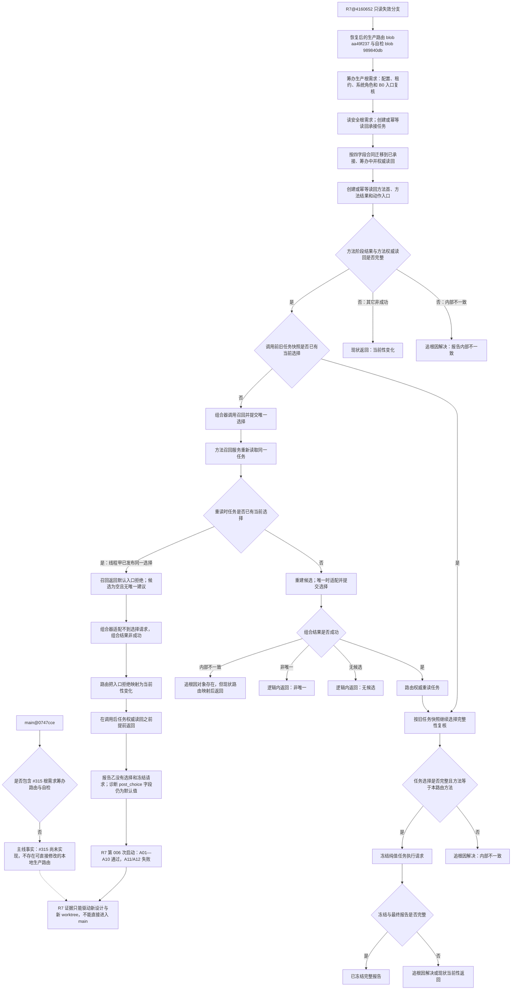

# 根需求任务筹办并发同义选择收口现状流程图

状态：历史证据保留 / 原“并发同义选择收口”纠偏结论已由 JY-546 撤回；不得继续作为 #315 施工依据。后继先以鱼巢正式规范迁移、源冲突门控和本项目结构映射为准，当前没有已发布的替代施工图。

更新时间：2026-07-20

## 元数据

```text
图类型：现状流程图
代码版本：main@0747cce491c3c6bbf37dbd49f61046b4097edee0；任务分支证据 R7@4160652079d7296264b902dfb98cc29eab855769
实现状态：main 尚无 #315 路由 / 自检；R7 只读失效分支保存已恢复的生产源码和并发返回点证据，不可集成
覆盖文件：
  R7:海中鱼巣/线程/路由.根需求筹办.ixx
  R7:海中鱼巣/线程/自检.根需求筹办.ixx
  main/R7 同 blob:海中鱼巣/领域/组合.需求任务方法.ixx
  main/R7 同 blob:海中鱼巣/领域/服务.方法召回.ixx
  R7:海中鱼巣/领域/服务.任务.ixx
覆盖函数：
  筹办生产根需求
  需求任务方法组合器::召回并提交唯一选择
  方法召回业务服务::召回
  方法召回业务服务::适配唯一建议
  任务业务服务::提交方法选择
  运行根需求筹办自检
逐行映射表：项目记忆/设计记录/20260720_REAL-GENERATION-LOOP-S1_R7并发同义选择逐行代码映射表.md
输入契约 / 调用语境表：项目记忆/设计记录/20260720_REAL-GENERATION-LOOP-S1_R7并发同义选择输入契约与调用语境表.md
非成功返回二分审查表：项目记忆/设计记录/20260720_REAL-GENERATION-LOOP-S1_R7并发同义选择非成功返回二分审查表.md
偏差清单：项目记忆/设计记录/20260720_REAL-GENERATION-LOOP-S1_R7并发同义选择现状施工偏差清单.md
依据实施记录：R7@4160652 的 实施记录/20260719_REAL-GENERATION-LOOP-S1_生产根需求承接与任务筹办代码实施_Codex断点清单.md 第 12 节
验证输出：D:/海中鱼巣/日志/诊断/REAL-GENERATION-LOOP-S1-R7/E281-WT-315-R7；6/60 次启动，001—005 通过，006 捕获 A11/A12 失败
不得作为施工许可：是
不得宣称：#315 已进入 main、生产竞态已修复、R7 可集成、#316 已解锁或真实生成闭环已完成
```

## 现状结论

`main@0747cce` 没有 `路由.根需求筹办.ixx` 和 `自检.根需求筹办.ixx`，所以 #315 仍未成为主线实现。R7 只能作为只读代码与运行证据：两线程同义筹办时，线程甲可能先发布当前选择；线程乙已经在旧任务快照中确认“尚无选择”，随后进入方法召回，召回服务再次读取同一任务并因“当前选择已存在”返回默认 `入口拒绝`。组合器因此没有提交第二份选择，路由把入口拒绝映射为 `当前性变化` 并在权威任务读回前提前返回，最终让报告乙缺少选择和冻结请求。

`report1_post_choice_present=0` 不是提前返回后的权威读回事实；该诊断字段没有到达赋值点，只保留默认值。

## 流程图



## 关键边界

```text
1. 主线缺少 #315 路由是当前 Git 事实；R7 源码不得冒充 main 已实现。
2. R7 的唯一根因证据是“召回入口重读发现并发当前选择 -> 入口拒绝 -> 路由提前返回”。
3. 入口拒绝本身不等于并发同义成功；必须由调用后权威任务与方法读回证明完整且全字段同义。
4. 召回内部不一致、读回不完整或选择半结构不得被并发读回掩盖。
5. R7 已只读失效且不可集成；后继只能从新 origin/main 建立新 worktree，并按计划固定恢复生产源树。
```

## 完成边界

本图只证明主线缺口、R7 只读代码路径和已捕获返回点。它不证明生产修复、20/20 连续验证、任务分支完成、独立集成或 #315 完成。
