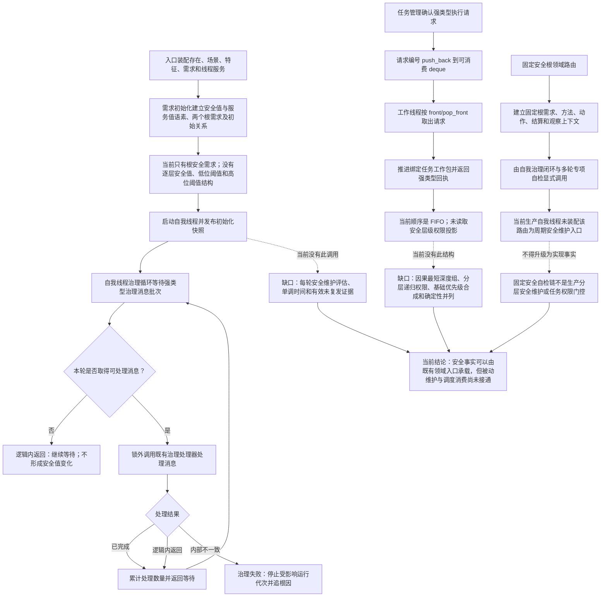

# SAFETY-PRIORITY：安全值维护与因果优先级现状流程图 v0.1

更新时间：2026-07-24

## 依据

- `规范/0050_项目通用机器逻辑与禁止性规则总纲_20260721.md`
- `规范/6100_子规范_安全服务值结算_20260720.md`
- `规范/6120_子规范_自我存在服务与生存基本因果闭环_20260720.md`
- `规范/8100_子规范_自我线程与任务管理线程权责边界_20260720.md`
- `规范/8200_子规范_自我内部循环实现_20260720.md`
- `海中鱼巣/领域/初始化.需求.ixx`
- `海中鱼巣/线程/自我线程.ixx`
- `海中鱼巣/线程/任务管理线程.ixx`
- `海中鱼巣/线程/任务工作线程.ixx`
- `海中鱼巣/线程/自我治理领域路由.ixx`
- `海中鱼巣/线程/自检.自我治理回执.ixx`
- `海中鱼巣/线程/自检.自我治理多轮.ixx`
- `海中鱼巣/入口.cpp`

## 现状元数据

| 项 | 当前事实 |
| --- | --- |
| 图类型 | 当前代码事实图；不是目标施工流程 |
| 扫描基线 | `main@af60227a4a4b2b9dbc766121ec8591cd56f23872` |
| 已有结构 | 自我、内部世界、根安全需求、根服务需求、强类型治理消息和强类型任务执行请求队列 |
| 当前调度 | 已确认的强类型任务执行请求按入队顺序进入 `deque`，由 `front/pop_front` 取出 |
| 当前安全维护 | 没有按自我线程循环调用的分层安全值维护入口 |
| 固定安全路由 | `自我治理领域路由` 的固定安全根链由专项自检装配调用，不能视为生产分层安全维护 |
| 当前缺口 | 无分层阈值、有效未复发时间、因素排除聚合、因果深度组、递归权限和任务权限投影 |
| 不得宣称 | 根安全初始化、自检链或 FIFO 队列不证明安全值被动变化及安全任务优先级门控已接通 |

## 身份与边界

本图只描述当前代码。线程、消息、队列顺序、自检报告、日志和显示都不是安全事实或任务优先级权限；固定安全根自检链也不是生产调度链。

## 关键边界

1. 根安全需求已初始化，不等于存在多层安全需求及各层阈值。
2. 自我线程当前按消息批次运行，没有“每轮必调、但不保证数值变化”的安全维护服务调用。
3. 强类型任务执行请求队列当前按确认顺序消费，不读取安全值、因果深度或任务执行优先级权限。
4. 固定安全根领域路由的调用证据位于专项自检装配；导入模块或自检通过不能证明生产接线。
5. 当前代码没有把时间、循环次数或队列状态写成安全事实，这一禁止边界必须保留。
6. 现状中的材料不足、无消息和无请求是逻辑内返回；前置成立后的治理处理内部不一致必须停止并追根因。
