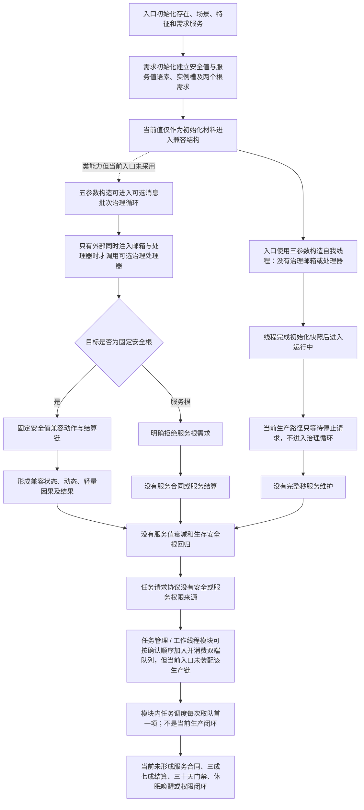

# 服务合同、服务值维护与生存安全回归现状流程图

更新时间：2026-07-24

## 依据

```text
规范/6100_子规范_安全服务值结算_20260720.md
规范/6120_子规范_自我存在服务与生存基本因果闭环_20260720.md
规范/6160_子规范_服务需求合同预算与准备结算.md
规范/6170_子规范_服务值时间维护生存安全回归与任务门控.md
海中鱼巣/领域/初始化.需求.ixx
海中鱼巣/领域/服务.需求.ixx
海中鱼巣/领域/服务.任务.ixx
海中鱼巣/领域/服务.方法.ixx
海中鱼巣/线程/自我线程.ixx
海中鱼巣/线程/自我治理领域路由.ixx
海中鱼巣/线程/协议.任务执行请求.ixx
海中鱼巣/线程/任务管理线程.ixx
海中鱼巣/线程/路由.任务执行调度.ixx
```

## 身份与边界

这是当前 `main` 的实现现状图，不是目标施工图。它只证明现行代码已建立安全值 / 服务值根需求与固定安全根兼容链，但尚未建立服务合同、完整秒维护、生存安全回归和安全 / 服务任务权限。

## 流程图



## 关键边界

```text
1. 当前初始化代码只建立根特征和根需求，不等于服务合同、维护规则或任务权限已经实现。
2. 当前生产入口使用三参数自我线程构造，初始化后只等待停止；五参数消息批次治理只是未装配类能力。循环次数、超时次数和消息数量都不能作为完整物理秒。
3. 固定安全根路由明确拒绝服务根需求，且固定数值兼容动作不能扩写为 6160 / 6170。
4. 当前需求、任务和方法服务没有合同唯一键、预算、预支、完工余款、有效进展或准备补回结构。
5. 当前任务请求与任务管理模块采用 FIFO 消费，不具备安全 / 服务根权限及 6150 分层权限组合，且生产入口没有装配该任务运行链。
6. 节点直接事务执行器可作为后续同事务底座，但不证明服务领域参与者和真实生产适配已经存在。
```
