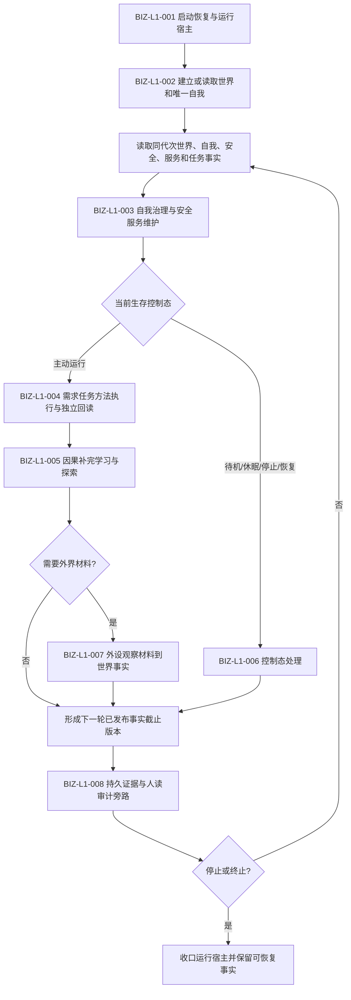

# BIZ-L0-001 项目总体业务生命周期目标业务流程图 v0.1

## 图身份

- 类型：正式目标业务设计图
- 层级：L0
- 规范覆盖：总体覆盖；具体机器语义由各 L1 图和正式规范裁决
- 新增机器语义：无
- 正式依据：0050、4190、5090、6180、6360、8100、8120、8200、8210、8300、8310、8320

## 输入与输出

输入：启动请求、可用恢复材料或全新事实域条件、单调时间、已发布世界与自我事实、合法人类需求、外设材料、停止或恢复控制请求。

输出：唯一当前运行上下文；一致的世界、自我、安全、服务、需求、任务、方法、状态、动态和因果事实；可审计持久证据；明确的继续、待机、休眠、停止或恢复结果。

前置条件：启动模式唯一；事实域身份、版本和所有权可裁决；全部写入只能通过具名领域服务；线程、日志、SQL、界面和消息都不承担机器事实。

完成条件：一次业务循环的输入事实、执行结果、独立回读、结算和后继裁决形成同一可追溯事实链，或以具名逻辑结果安全停止；任何失败不得留下半发布结构。

## 总体流程

## 一级节点合同

| 节点 | 核心责任 | 权威事实写入 | 完成判据 |
| --- | --- | --- | --- |
| BIZ-L1-001 | 建立唯一合法运行上下文 | 启动/恢复领域的发布事实 | 隔离验证后发布唯一上下文或具名拒绝 |
| BIZ-L1-002 | 维护现实世界、场景、自我和子存在的完整结构事实 | 世界树业务服务 | 同代次完整快照可回读 |
| BIZ-L1-003 | 按完整秒维护服务值、生存安全根值、分层安全值和任务权限 | 安全、服务领域 | 值、状态、动态、维护账和权限来源一致 |
| BIZ-L1-004 | 从正差距形成需求、任务、方法执行和实际结果 | 需求、任务、方法及结果所属领域 | 实际结果由权威领域独立回读，结算闭合 |
| BIZ-L1-005 | 补全因果、形成学习后继或探索需求 | 因果、方法、需求领域 | 新证据不覆盖旧事实，后继版本可回查 |
| BIZ-L1-006 | 裁决待机、休眠、唤醒、停止和恢复的开放入口 | 生存控制与运行宿主 | 控制态与可调用入口严格一致 |
| BIZ-L1-007 | 把外设供料转化为可验证世界事实 | 外设材料领域和目标世界领域 | 原始材料不直接冒充世界事实 |
| BIZ-L1-008 | 保存恢复证据并生成人读投影 | 持久证据端口；非权威投影 | 投影失败不反写或改变业务事实 |

## 事实与事务总边界

- 内存中已发布领域事实是运行期机器事实；独立材料文件保存可恢复权威证据；SQL、日志和 UI 仅为审计或人读投影。
- 一个业务闭环可以包含多个领域事务，但每个公开结果必须绑定明确事实截止版本；跨领域聚合若要求原子可见，必须使用全参与者准备、确认、逆序撤销和最后发布。
- 自我线程只编排每轮治理；工作线程只执行已冻结方法；二者均不得绕过领域服务直接写事实。

## L0 设计缺口

1. L0 已能确定八个一级业务闭环，但不能直接冻结全部 DTO 字段；字段 ABI 应在相应 L1 节点继续展开后冻结。
2. 当前能力证据表仍有大量 `候选待复核`，因此本图不声明需求、任务、方法、因果和世界树全部已实现。
3. 世界树目标设计正在另一路径形成；本图只引用正式 4200 语义，不覆盖其活动设计切片。
