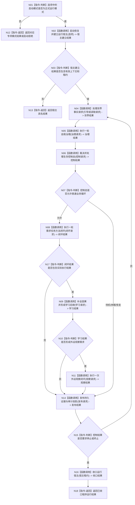

# BIZ-L0-001 项目总体业务生命周期目标函数流程图 v0.2

更新时间：2026-08-03

## 依据

```text
0050、4190、5090、6180、6360、8100、8120、8200、8210、8300、8310、8320
```

## 身份与边界

正式目标函数设计图。唯一根函数负责项目级启动模式路由和完整运行生命周期编排；不证明当前代码已经具备全部 L1 成功路径。

## 函数合同

```text
根函数：运行海中鱼巣
归属模块 / 文件 / 层级：启动应用 / 海中鱼巣/启动.应用程序.ixx / L0
现有或待新增：现有函数适配扩展
完整签名：程序运行结果 运行海中鱼巣(const 启动选项& 选项)
参数：
  选项：const 启动选项&，只读借用，调用期间有效；模式必须已经通过入口解析
返回结果：
  程序运行结果；覆盖正常停止、启动拒绝、恢复失败、运行失败、终止控制和内部错误
被调函数流程图：BIZ-L1-001—BIZ-L1-008
```

输入事实：强类型启动选项以及运行宿主后续取得的已发布事实。输出事实：程序运行结果；业务事实只能由被调领域函数发布。

完成条件：一次运行生命周期安全收口，或在任一 L1 函数返回具名非成功结果后停止依赖路径；不得留下部分发布的运行上下文。

## 流程图



## 节点合同

| 节点 | 类型 | 参数 / 输入绑定 | 结果 / 输出绑定 | 事实读写 | 后继条件 | 验证 |
| --- | --- | --- | --- | --- | --- | --- |
| N01 | 指令-判断 | 选项.模式 | 正式运行/专项或拒绝 | 无 | 唯一分支 | 启动模式矩阵 |
| N02 | 函数调用 | 选项 -> 选项 | 上下文和宿主租约 | 只由 L1-001 写启动/恢复事实 | 调用完成 | 启动恢复专项 |
| N04 | 函数调用 | 当前上下文和请求 | 世界结果 | 世界领域 | 结果可用或具名停止 | 世界事实专项 |
| N05 | 函数调用 | 世界/自我快照、时间 | 治理结果 | 安全、服务和治理领域 | 调用完成 | 完整秒治理专项 |
| N06 | 函数调用 | 治理结果和当前控制事实 | 控制结果 | 生存控制领域 | 控制态已裁决 | 0/1/>1 矩阵 |
| N08 | 函数调用 | 当前权限和目标事实 | 闭环结果 | 需求、任务、方法和目标领域 | 调用完成 | 生产闭环专项 |
| N09 | 函数调用 | 执行前后与实际结果 | 学习结果 | 因果、方法和探索领域 | 调用完成 | 因果来源专项 |
| N11 | 函数调用 | 观察需求与冻结方法 | 观察结果 | 外设材料及目标世界领域 | 调用完成 | 外设材料专项 |
| N14 | 函数调用 | 已发布批次 | 发布结果 | 持久证据；审计仅投影 | 不改变业务结果 | 失败隔离专项 |
| N16 | 函数调用 | 宿主租约 | 收口结果 | 保存恢复边界 | 收口完成 | 幂等停止 |
| N12/N13/N18 | 指令-返回 | 当前具名结果 | 程序运行结果 | 无新增业务事实 | 函数结束 | 全返回覆盖 |

## 关键边界

- 根函数只编排，不取得八个 L1 领域的事实写权。
- 运行循环不能用线程心跳、SQL、日志或 UI 推断业务成功。
- N04—N14 的具体循环频率和触发条件由 L1 合同裁决；本图不把所有函数强制为每轮都有写入。
- 专项模式不进入目标生产闭环，仍沿现有启动模式合同返回。
