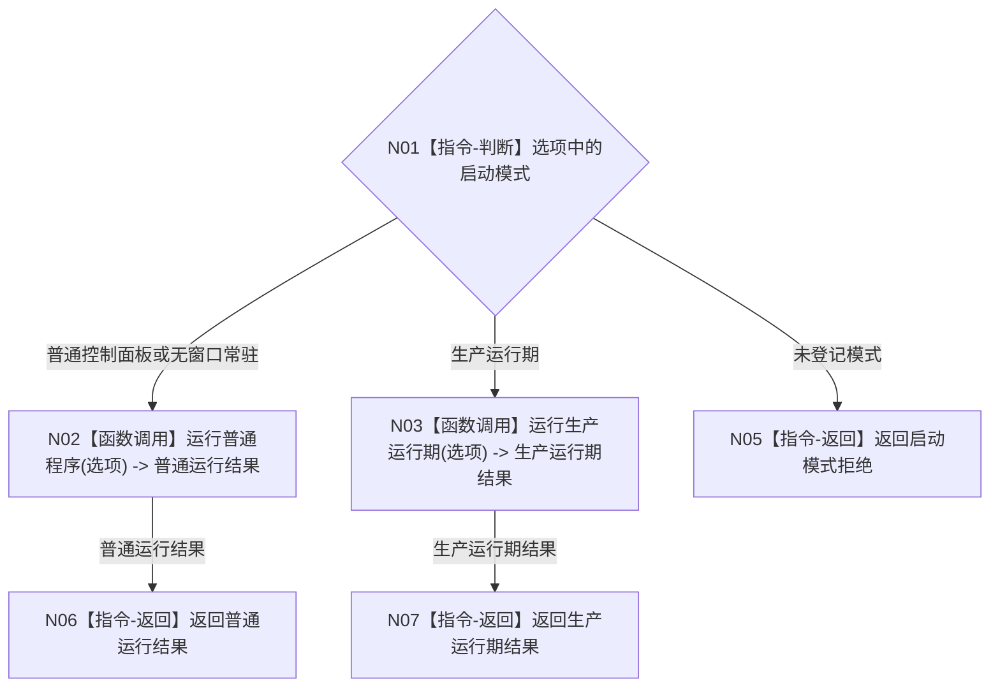

# BIZ-L0-001 项目总体业务生命周期目标函数流程图 v0.3

更新时间：2026-08-13

## 依据

```text
0050、6340、6360、8100、8110、8120、8200、8300、8310、8320
旧鱼巢参考：流程图/鱼巢流程/20260712_旧鱼巢运行主链与两条旁路总览现状流程图_v0.1.md
业务主链承接：BIZ-MAIN-001_自我治理到需求任务方法结果结算_目标业务流程图_v0.1.md
```

## 身份与边界

正式目标函数设计图。本版按 8120 v0.6 重新校准：`BIZ-L0` 只表示目标分解的顶层，不是数据服务 L0；本函数只负责三个正式生产模式的路由，不在程序主线程同步执行世界、自我、任务、方法、外设和审计业务循环。

## 函数合同

```text
根函数：运行海中鱼巣
归属模块 / 文件 / 目标分解深度：启动应用 / 海中鱼巣/启动.应用程序.ixx / BIZ-L0
现有或待新增：现有函数适配扩展
完整签名：程序运行结果 运行海中鱼巣(const 启动选项& 选项)
参数：
  选项：const 启动选项&，只读借用，调用期间有效；已经由薄入口完成解析
返回结果：
  程序运行结果；覆盖普通生产运行正常停止、启动拒绝、装配失败、初始化失败、运行失败和内部错误
被调函数流程图：BIZ-L1-T01；生产运行期模式沿 8120 的独立函数合同
```

## 流程图



## 节点合同

| 节点 | 类型 | 参数 / 输入绑定 | 结果 / 输出绑定 | 事实读写 | 后继条件 | 验证 |
| --- | --- | --- | --- | --- | --- | --- |
| N01 | 指令-判断 | `选项.模式` | 唯一模式分支 | 无 | 只进入一个分支 | 启动模式矩阵 |
| N02 | 函数调用 | 选项 -> 选项 | 普通运行结果 | 由 BIZ-L1-T01 编排初始化和宿主；BIZ-L0 不写业务事实 | 调用返回 | 普通控制面板 / 无窗口模式矩阵 |
| N03 | 函数调用 | 选项 -> 生产运行期请求 | 生产运行期结构化结果 | 只进入正式生产运行期合同 | 调用返回 | 生产运行期模式矩阵 |
| N05—N07 | 指令-返回 | 当前结构化结果 | 程序运行结果 | 无新增事实 | 函数结束 | 退出码映射 |

## 关键边界

- `运行海中鱼巣` 不包含普通业务驻留循环，不轮询业务队列，也不调用一轮自我治理、任务闭环、外设观察或审计发布。
- 普通模式只调用一次 `运行普通程序`；该生产调用方先按 8120 完成 `I1 -> I2 -> SELF-FORM -> 存在/特征/动态/因果链四个语言无关概念本体根生产初始化` 门禁，才允许进入后继初始化和普通多线程宿主。
- 旧鱼巢主链没有被删去，而是从 L0 同步调用链迁入 BIZ-MAIN-001 的跨线程业务闭环；L0 只保留模式路由，避免程序主线程重新拥有业务写权。
- 生产运行期模式不得隐式启动普通控制面板链；普通模式不得隐式运行完整自检或专项验收。
- 线程启动、消息入队、日志或 UI 显示均不证明业务成功；程序结果只证明宿主是否按合同收口。
