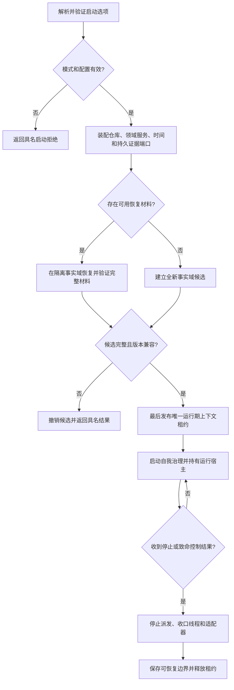

# BIZ-L1-001 启动恢复与运行宿主目标业务流程图 v0.1

## 合同

- 正式依据：0050、6180、8120、8300、8310
- 输入：命令行参数、装配配置、可选恢复材料、停止信号端口
- 输出：唯一运行期上下文租约和启动报告，或具名拒绝/恢复失败
- 前置：启动模式唯一；恢复材料与当前格式版本可识别；没有并发发布者占用同一运行代次
- 完成：全部基础事实在隔离候选中验证后最后发布；宿主持有租约直至停止；失败零可见半结构
- 事实写入：启动代次、恢复报告、运行期上下文发布事实
- 事务：恢复和全新引导均先隔离形成候选，再统一确认与最后发布

## 节点合同

| 节点 | 业务能力 | 逻辑结果 | 目标函数组 |
| --- | --- | --- | --- |
| A | 唯一解析模式且拒绝冲突组合 | 已准入/参数无效/模式冲突 | `解析并验证启动选项` |
| C | 只装配依赖，不借构造写业务事实 | 已装配/依赖缺失/版本不兼容 | `启动海中鱼巣运行宿主` |
| E/F | 恢复或全新建立同一形状的候选上下文 | 已形成/材料缺口/格式拒绝 | `恢复或建立运行期上下文` |
| H | 原子发布唯一运行代次和租约 | 已发布/已有当前/发布竞争 | `恢复或建立运行期上下文` |
| I/K/L | 持有、停止和释放进程级生命周期 | 正常停止/终止/收口失败 | `收口运行宿主` |

## 关键边界与待展开项

- SQL、日志、UI 和线程状态不能证明恢复成功；恢复成功必须由隔离业务事实回读证明。
- 当前 CAP-0001、CAP-0013、CAP-0016 可作为入口和宿主候选；完整恢复与唯一上下文原子切换仍需 L2 函数规格。
- 此闭环不规定世界树内部结构；它只保证后续 BIZ-L1-002 获得合法事实域和服务依赖。
