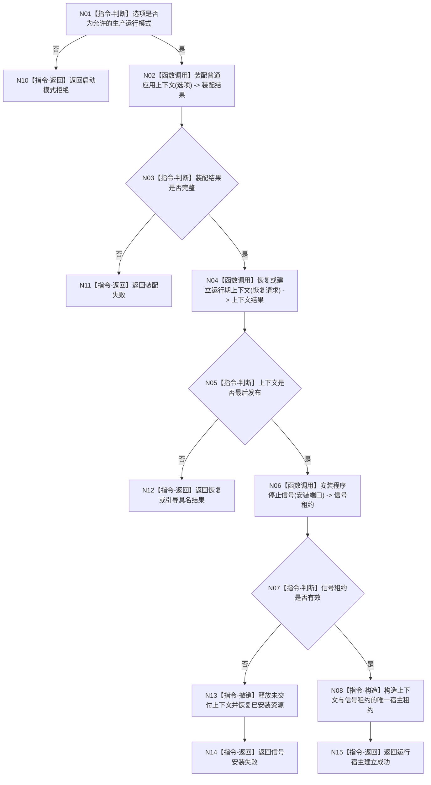

# BIZ-L1-001 启动恢复与运行宿主目标函数流程图 v0.2

更新时间：2026-08-03

## 依据

```text
0050、6180、8120、8300、8310
```

## 身份与边界

正式目标函数设计图；唯一根函数建立或恢复运行期上下文并返回宿主租约，不承担业务循环，也不在返回前长期阻塞持有宿主。

## 函数合同

```text
根函数：启动恢复并建立运行宿主
归属模块 / 文件 / 层级：启动应用 / 海中鱼巣/启动.应用程序.ixx / L1
现有或待新增：待新增；可组合 CAP-0001、CAP-0013、CAP-0016
完整签名：运行宿主建立结果 启动恢复并建立运行宿主(const 启动选项& 选项)
参数：选项为只读借用，调用期间有效；模式必须为普通生产运行模式
返回结果：运行宿主建立结果；成功时包含唯一运行期上下文租约和停止信号租约，非成功时包含启动拒绝、装配失败、恢复失败和内部错误
被调函数流程图：恢复或建立运行期上下文（待生成 L2）
```

## 流程图



## 节点合同

| 节点 | 类型 | 输入绑定 | 输出绑定 | 事实读写 | 验证 |
| --- | --- | --- | --- | --- | --- |
| N02 | 函数调用 | 选项 | 装配结果 | 只装配，不写业务事实 | 依赖缺失矩阵 |
| N04 | 函数调用 | 恢复材料、格式和代次 | 上下文结果 | 隔离候选后最后发布 | 全新/恢复/冲突 |
| N06 | 函数调用 | 安装端口 | 信号租约 | 进程级状态 | 失败逆序恢复 |
| N08 | 指令-构造 | 上下文、信号租约 | 唯一宿主租约 | 转移生命周期所有权 | 所有权唯一 |
| N13 | 指令-撤销 | 未交付上下文和资源 | 已恢复局部状态 | 不发布宿主租约 | 逆序恢复 |

## 关键边界

恢复成功必须由隔离业务事实回读证明；SQL、日志、UI 和线程状态都不能证明恢复成功。根函数成功返回后由 L0 持有租约、执行业务循环并最终调用统一收口函数。
