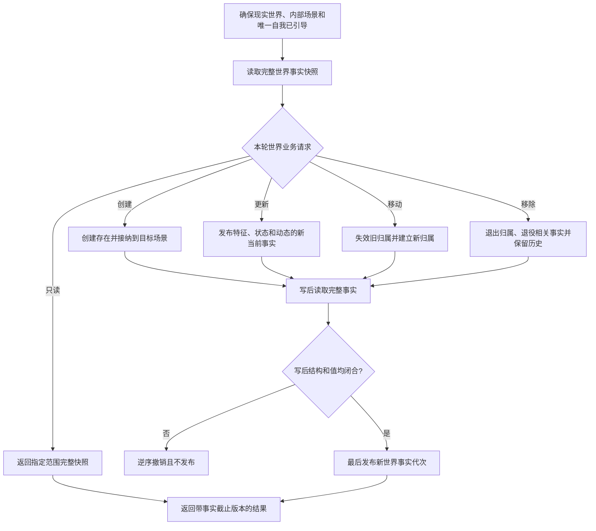

# BIZ-L1-002 世界认识与世界事实维护目标业务流程图 v0.1

## 合同

- 正式依据：0050、4190、4200、6180
- 输入：运行期上下文、世界引导请求、创建/更新/移动/移除请求、事实截止版本
- 输出：唯一现实世界与唯一自我材料，或目标存在/场景/世界的同代次完整快照
- 前置：调用方使用世界树统一业务门面；身份、类型、版本、归属和预期代次完整
- 完成：节点、关系、特征、当前值、状态、动态和领域记录在同一可见代次闭合
- 事实写入：世界结构、存在归属、特征当前值、状态、动态和退役/退出事实
- 事务：跨仓写入使用统一结构事务；读取得到同代次快照而非多次普通读取拼接

## 节点合同

| 节点 | 必须处理的事实 | 禁止替代 | 目标函数组 |
| --- | --- | --- | --- |
| A | 世界根、内部场景、自我、所在场景及唯一关系 | 名称推断、旧 fallback | `确保现实世界已引导` |
| B/H | 指定范围内节点、关系、特征值、状态、动态和版本 | 调用方多次读取自行拼接 | `读取完整世界事实快照` |
| D | 身份准入、类型、初始归属、初始特征和状态 | 先建空节点再跨事务补材料 | `创建并接纳世界树存在` |
| E | 旧当前失效、新当前唯一、状态动态完整 | 直接改值或只写日志 | `更新世界树存在事实` |
| F | 预期旧父、目标父、无环、顺序和并发代次 | 复制节点或旧普通父子猜测 | `移动世界树成员` |
| G | 影响面、归属退出、索引失效、历史保留 | 无审计直接物理删除 | `移除世界树存在` |

## 关键边界与待展开项

- 4200 是本图的机器语义权威；当前世界树 P1A2/P1A3/P1C 活动设计和代码 WIP 只作实施现场，不能由本图覆盖。
- “移除”不等于抹去历史；旧命名域推断、恢复服务解码和双路兼容已经不进入目标业务。
- 各公开函数的精确 DTO 字段、版本和文件身份由世界树详细设计继续冻结；映射见 BIZ-MAP-001。
