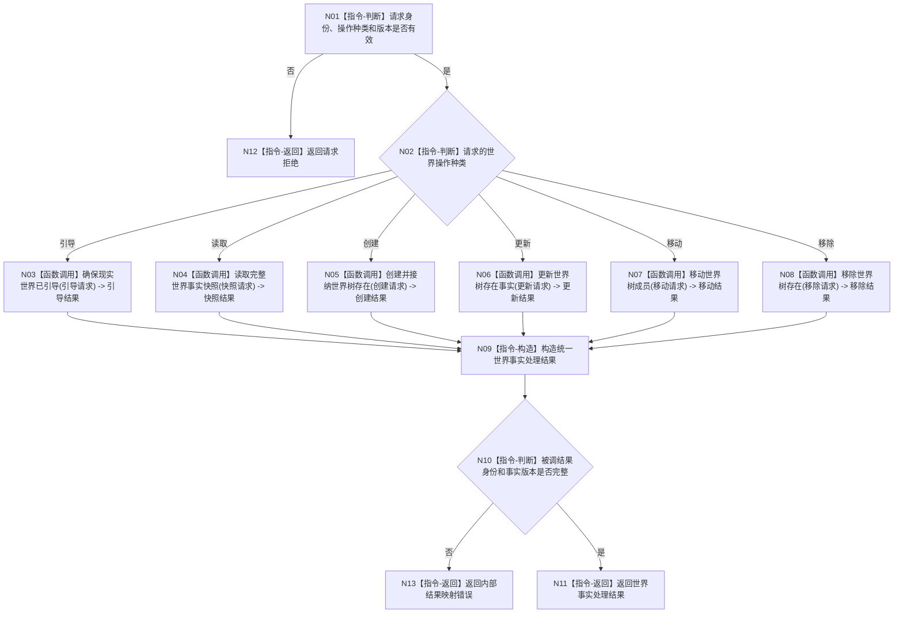

# BIZ-L1-002 世界认识与世界事实维护目标函数流程图 v0.2

更新时间：2026-08-03

## 依据

```text
0050、4190、4200、6180
```

## 身份与边界

正式目标函数设计图；唯一根函数是世界树业务门面的请求分派入口，不能绕过具体 L2 函数直接操作仓库。

## 函数合同

```text
根函数：处理世界事实请求
归属模块 / 文件 / 层级：世界树业务 / 海中鱼巣/领域/服务.世界树业务.ixx / L1
现有或待新增：待新增；当前 WORLD-TREE 设计链正在提供其 L2 能力
完整签名：世界事实处理结果 世界树业务服务::处理世界事实请求(const 世界事实处理请求& 请求)
参数：请求为只读借用；必须携带操作种类、身份、预期代次、规则和材料版本
返回结果：世界事实处理结果；包含完整快照或写后完整事实，以及拒绝、冲突、撤销和内部错误
被调函数流程图：确保现实世界已引导、读取完整世界事实快照、创建并接纳世界树存在、更新世界树存在事实、移动世界树成员、移除世界树存在
```

## 流程图



## 节点合同

| 节点 | 类型 | 输入绑定 | 输出绑定 | 事实读写 | 验证 |
| --- | --- | --- | --- | --- | --- |
| N03 | 函数调用 | 引导子请求 | 世界、自我和场景材料 | 世界结构领域 | 唯一根/唯一自我 |
| N04 | 函数调用 | 范围、截止版本 | 同代次完整快照 | 只读 | 多仓一致版本 |
| N05 | 函数调用 | 身份、归属、初始事实 | 完整存在事实 | 世界领域事务 | 零半结构 |
| N06 | 函数调用 | 预期当前和新事实 | 新当前事实 | 特征/状态/动态 | 旧新唯一 |
| N07 | 函数调用 | 旧父、目标父、代次 | 新归属 | 结构关系 | 无环和并发 |
| N08 | 函数调用 | 影响面与预期代次 | 退出/退役材料 | 结构和索引 | 历史保留 |

## 关键边界

根函数只作强类型分派与结果映射；旧命名域推断、fallback、直接删除和双路兼容不进入目标函数。
