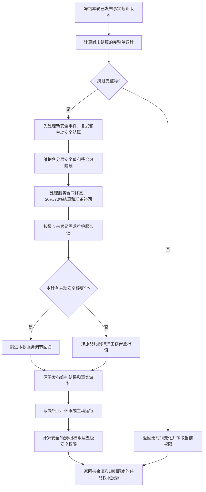

# BIZ-L1-003 自我治理与安全服务维护目标业务流程图 v0.1

## 合同

- 正式依据：6100、6120、6140、6150、6160、6170、8200
- 输入：自我身份、已发布事实截止版本、单调时间、上一完整秒游标、当前安全/服务/合同/任务材料
- 输出：维护结果、控制态、安全与服务任务权限投影，以及下一步治理许可
- 前置：自我、时间纪元、规则版本、阈值和值均完整；调用方不使用循环次数代替时间
- 完成：到期完整秒按参考顺序结算；值、状态、动态、合同、衰减段和维护账一致发布
- 事实写入：分层安全维护账、服务值、生存安全根值、状态动态、合同结算与事实游标
- 事务：同秒合同终态、准备补回、服务衰减和安全根回归不得形成可见中间状态

## 节点合同

| 节点 | 确定规则 | 目标函数组 |
| --- | --- | --- |
| B | 每轮最多调用一次，但数值只按完整单调秒；批量必须等价逐秒 | `执行一轮自我治理` |
| D/E | 新事件优先；分层值按有效未复发证据回归 L/H，不改生存安全根 | `维护分层安全值` |
| F/G | 需求预支 30%、完成 70%；无需求步长 1；最长未满足达到 30 天触发 0/1 门禁 | `维护服务与生存安全` |
| J | `V=0` 时根值到 1；`V>0` 时按比例向 L/H 回归，真实安全事件优先 | `维护服务与生存安全` |
| L/M | `A=0` 终止，`A=1` 休眠，`A>1` 主动；安全不足时服务任务权限为 0 | `裁决生存控制态`、`计算任务执行权限` |

## 关键边界与待展开项

- 五级只调节安全任务执行权限精度，不截断更深因果链。
- 自我线程只是调用 `执行一轮自我治理`，不是安全或服务动作来源，也不得直接写值。
- 三个目标领域入口的精确 DTO、跨领域参与者和批量跳跃算法必须形成 L2 函数规格后才能实施。
