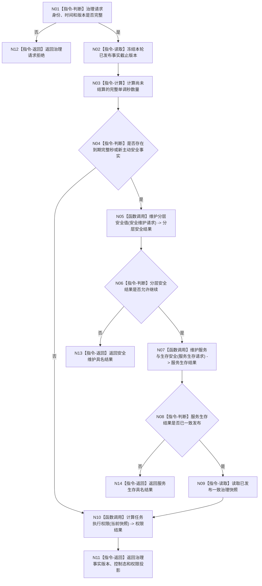

# BIZ-L1-003 自我治理与安全服务维护目标函数流程图 v0.2

更新时间：2026-08-03

## 依据

```text
6100、6120、6140、6150、6160、6170、8200
```

## 身份与边界

正式目标函数设计图；唯一根函数编排一轮自我治理。每轮最多调用一次，但所有数值只按完整单调秒维护。

## 函数合同

```text
根函数：执行一轮自我治理
归属模块 / 文件 / 层级：自我治理领域 / 海中鱼巣/领域/服务.自我治理.ixx / L1
现有或待新增：待新增；CAP-0044 只证明线程侧相邻能力
完整签名：自我治理结果 自我治理服务::执行一轮自我治理(const 自我治理请求& 请求)
参数：请求为只读借用；必须含自我身份、运行代次、单调时间、事实截止版本和规则版本
返回结果：自我治理结果；包含维护事实版本、控制态、任务权限投影或具名无变化/拒绝/内部错误
被调函数流程图：BIZ-L2-003-01 维护分层安全值；BIZ-L2-003-02 维护服务与生存安全；BIZ-L2-003-03 计算任务执行权限
```

## 流程图



## 节点合同

| 节点 | 类型 | 输入绑定 | 输出绑定 | 事实读写 | 验证 |
| --- | --- | --- | --- | --- | --- |
| N02 | 指令-读取 | 请求.事实截止版本 | 冻结快照 | 只读 | 版本漂移拒绝 |
| N03 | 指令-计算 | 单调时间、上一边界 | 完整秒数量 | 无 | 调用频率等价 |
| N05 | 函数调用 | 安全事实和有效时间 | 分层安全结果 | 安全领域 | 新事件优先 |
| N07 | 函数调用 | 合同、服务值、安全根、完整秒 | 服务生存结果 | 服务/安全事务 | 逐秒等价 |
| N10 | 函数调用 | 已发布一致快照 | 权限投影 | 零持久写入 | 守恒和来源 |

## 关键边界

自我线程只调用本函数，不直接写安全值、服务值、合同、状态或动态；无完整秒仍可合法返回当前权限投影。
