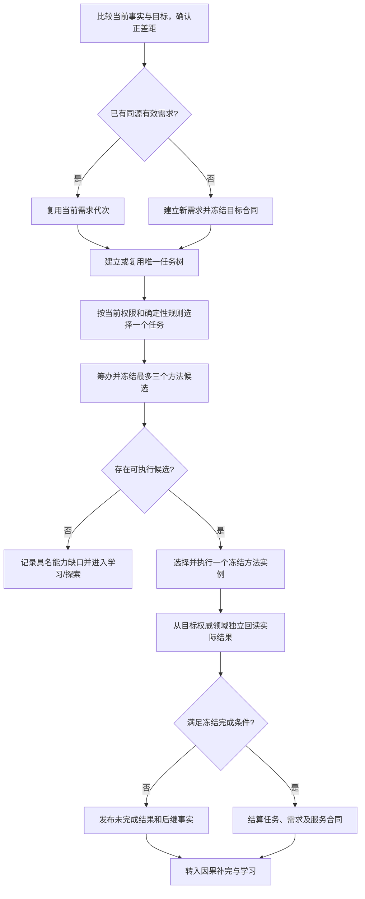

# BIZ-L1-004 需求任务方法执行与独立回读目标业务流程图 v0.1

## 合同

- 正式依据：3100、3200、5090、5300、8100、8200、8210
- 输入：当前自我与世界完整快照、任务权限投影、已有需求/任务/方法事实
- 输出：需求和唯一任务树、冻结方法候选、一次方法执行回执、独立实际结果与结算结果
- 前置：控制态允许普通任务竞争；事实快照和权限来源当前；目标与满足条件可机器比较
- 完成：实际结果由目标事实所有者独立回读；任务完成、需求满足和服务合同结算均有同源证据
- 事实写入：需求、任务、方法选择、执行状态、目标领域结果、任务/需求/合同结算
- 事务：每个领域独立原子发布；跨领域结算绑定已发布结果和精确版本，不以执行回执冒充成功

## 节点合同

| 节点 | 业务裁决 | 目标函数组 |
| --- | --- | --- |
| A | 只有可比较的正差距才能形成需求来源 | `确认当前正差距` |
| B-D | 同一来源和有效期内需求/服务合同唯一；到期重提必须来自提出者 | `建立或复用需求任务树` |
| E/F | 任务树唯一；按带来源权限排序，不按线程或队列标签分类 | `建立或复用需求任务树`、`计算任务执行权限` |
| G | 候选最多三个，顺序、版本、适用条件和选择原因冻结 | `筹办并冻结方法候选` |
| I | 一轮只执行一个冻结实例；工作线程不改业务合同 | `执行一个冻结方法实例` |
| J/K | 结果由目标领域重读，不采信方法自报成功、日志或界面 | `独立回读任务实际结果` |
| M | 完成证据同时驱动任务、需求和服务合同 70% 余款 | `结算任务需求与服务合同` |

## 关键边界与待展开项

- CAP-0038—CAP-0040 表明当前已有大量需求、任务、方法候选能力，但多数尚未形成完整生产闭环运行证据。
- `独立回读任务实际结果` 应按目标事实类型向所属领域分派，不能形成一个绕过领域服务的全知仓库读取器。
- 方法实例的共同执行 DTO 与领域特有载荷需继续在 L2 确认。
