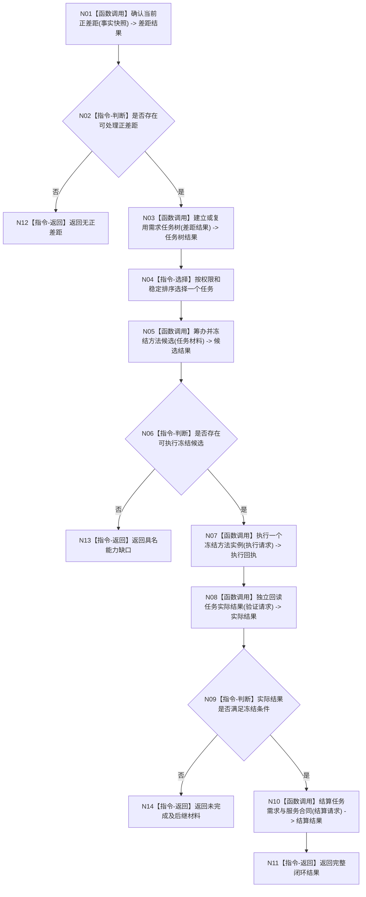

# BIZ-L1-004 需求任务方法执行与独立回读目标函数流程图 v0.2

更新时间：2026-08-03

## 依据

```text
3100、3200、5090、5300、8100、8200、8210
```

## 身份与边界

正式目标函数设计图；唯一根函数执行一轮需求、任务、方法、实际结果和结算闭环。

## 函数合同

```text
根函数：执行一轮需求任务方法闭环
归属模块 / 文件 / 层级：需求任务方法治理 / 海中鱼巣/领域/服务.需求任务方法治理.ixx / L1
现有或待新增：待新增；CAP-0038—CAP-0040提供相邻候选
完整签名：需求任务方法闭环结果 需求任务方法治理服务::执行一轮需求任务方法闭环(const 需求任务方法闭环请求& 请求)
参数：请求为只读借用；必须含自我与世界快照、权限投影、事实截止版本和规则版本
返回结果：闭环结果；包含需求/任务/方法/实际结果/结算身份，或无正差距、无方法、未完成、拒绝和内部错误
被调函数流程图：确认当前正差距、建立或复用需求任务树、筹办并冻结方法候选、执行一个冻结方法实例、独立回读任务实际结果、结算任务需求与服务合同
```

## 流程图



## 节点合同

| 节点 | 类型 | 输入绑定 | 输出绑定 | 事实读写 | 验证 |
| --- | --- | --- | --- | --- | --- |
| N01 | 函数调用 | 当前与目标事实 | 正差距 | 只读 | 可比较性 |
| N03 | 函数调用 | 正差距与来源 | 唯一任务树 | 需求/任务领域 | 同源唯一 |
| N05 | 函数调用 | 任务权威材料 | 最多三个候选 | 方法领域 | 冻结顺序 |
| N07 | 函数调用 | 授权、候选、上下文 | 执行回执 | 方法所属领域 | 一轮一个实例 |
| N08 | 函数调用 | 目标和截止版本 | 实际结果 | 只读目标领域 | 不采信自报 |
| N10 | 函数调用 | 实际结果和当前版本 | 结算结果 | 任务/需求/合同 | 30/70分账 |

## 关键边界

执行回执不等于成功；只有目标事实所有者独立回读的实际结果可以进入完成与结算判断。
