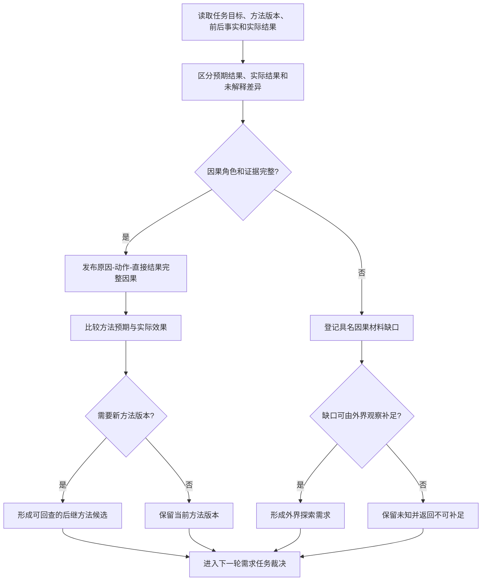

# BIZ-L1-005 因果学习与外界探索目标业务流程图 v0.1

## 合同

- 正式依据：1190、4210、5090、6150、8210、8320
- 输入：任务目标、方法冻结版本、执行前后事实、独立实际结果、失败或材料缺口
- 输出：完整因果事实、方法后继候选、探索需求或无学习结果
- 前置：前后事实和动作来源可回读；因果角色、场景、版本和证据完整
- 完成：新增因果和后继版本不覆写历史；未知保持未知；探索需求具名指向材料缺口
- 事实写入：原因、动作、直接结果及其证据；方法后继版本；探索需求
- 事务：因果事实、方法版本和探索需求各由自己的领域发布，后继只引用已发布上游事实

## 节点合同

| 节点 | 业务裁决 | 目标函数组 |
| --- | --- | --- |
| A/B | 执行回执只证明发生调用；实际效果取独立回读事实 | `补全实际结果因果链` |
| C/D | 直接因果不隐藏中间结果；路径、场景、主体和版本完整 | `补全实际结果因果链` |
| E/G/K | 缺证据不猜测，能由外界获取时才建立探索需求 | `形成外界探索需求` |
| F/H/I | 学习形成新版本，不原地改写已执行方法 | `形成后继方法版本` |

## 关键边界与待展开项

- 当前 CAP-0037 仅证明轻量因果引用候选，不能当作完整因果、学习和探索闭环。
- 因果层级可以超过五层；五级只用于任务权限投影，不能删除深层证据。
- L2 需冻结完整因果 DTO、反证/失效、方法版本比较以及探索需求去重合同。
