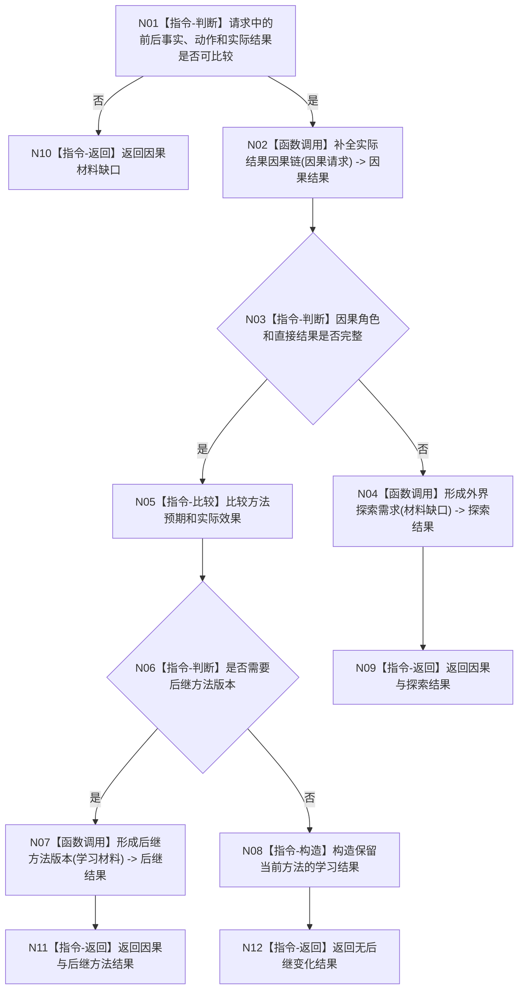

# BIZ-L1-005 因果学习与外界探索目标函数流程图 v0.2

更新时间：2026-08-03

## 依据

```text
1190、4210、5090、6150、8210、8320
```

## 身份与边界

正式目标函数设计图；唯一根函数把已发布实际结果转换为完整因果、方法后继或探索需求，不猜测缺失证据。

## 函数合同

```text
根函数：补全因果并形成学习后继
归属模块 / 文件 / 层级：因果学习 / 海中鱼巣/领域/服务.因果学习.ixx / L1
现有或待新增：待新增；CAP-0037只有轻量因果候选
完整签名：因果学习结果 因果学习服务::补全因果并形成学习后继(const 因果学习请求& 请求)
参数：请求为只读借用；必须含目标、冻结方法、执行前后事实、实际结果、场景和版本
返回结果：因果学习结果；包含因果身份、方法后继、探索需求或无学习/材料缺口/内部错误
被调函数流程图：补全实际结果因果链、形成后继方法版本、形成外界探索需求
```

## 流程图



## 节点合同

| 节点 | 类型 | 输入绑定 | 输出绑定 | 事实读写 | 验证 |
| --- | --- | --- | --- | --- | --- |
| N02 | 函数调用 | 前后事实、动作、结果 | 完整因果或缺口 | 因果领域 | 角色/直接性 |
| N04 | 函数调用 | 具名缺口 | 探索需求 | 需求领域 | 不可补足分支 |
| N07 | 函数调用 | 因果和方法历史 | 新方法候选 | 方法领域 | 历史不覆写 |

## 关键边界

五级安全权限不截断因果深度；未知必须保持未知，日志解释不得补成因果事实。
