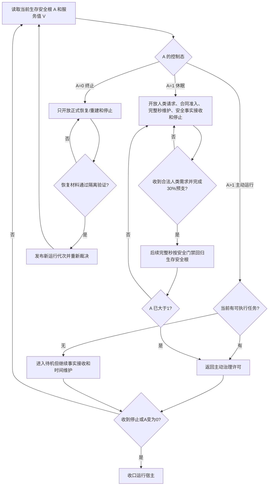

# BIZ-L1-006 待机休眠唤醒停止恢复目标业务流程图 v0.1

## 合同

- 正式依据：6120、6170、8100、8120、8200、8300、8310
- 输入：生存安全根值、服务值、当前任务事实、合法人类请求、停止请求、恢复材料
- 输出：控制态、允许入口集合、唤醒/停止/恢复结果
- 前置：控制态来自当前已发布安全根，不从线程、UI 或日志推断
- 完成：不同控制态只开放规范允许入口；状态转换由合法事实驱动并可回读
- 事实写入：控制态来源事实、唤醒或停止结果、恢复运行代次
- 事务：服务预支、安全回归和控制态裁决按 6170 顺序；停止和恢复由运行宿主持有生命周期

## 节点合同

| 节点 | 开放边界 | 目标函数组 |
| --- | --- | --- |
| C | 禁止普通任务竞争；恢复不能猜测缺失时间或事实 | `裁决生存控制态`、`恢复或建立运行期上下文` |
| D | 请求接收不等于唤醒；不得直接把 A 写成活跃 | `处理唤醒请求` |
| E-G | 待机不是休眠；仍执行治理、观察和时间维护 | `执行一轮自我治理` |
| I/J | 合同预支先使 V 为正，后续合法完整秒使 A 从 1 上升 | `维护服务与生存安全` |
| N | 停止派发、收口线程和端口、保存恢复边界 | `收口运行宿主` |

## 关键边界与待展开项

- `A=0` 是终止控制态，`A=1` 是可唤醒休眠态，二者的普通安全/服务任务权限均为零。
- “待机”只是主动运行态没有当前可执行任务，不产生新的安全或服务值语义。
- 需在 L2 冻结停止失败、恢复竞争、唤醒幂等和跨代次时间证据结果类型。
