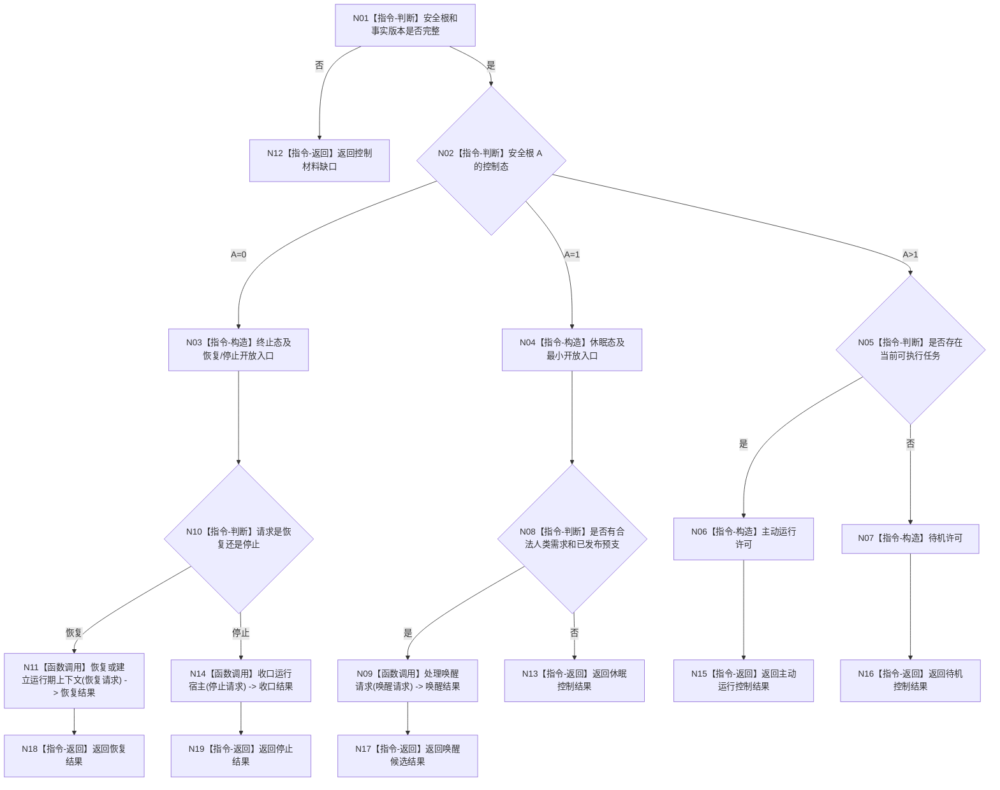

# BIZ-L1-006 待机休眠唤醒停止恢复目标函数流程图 v0.2

更新时间：2026-08-03

## 依据

```text
6120、6170、8100、8120、8200、8300、8310
```

## 身份与边界

正式目标函数设计图；唯一根函数读取已发布生存事实，裁决控制态及允许入口，不直接修改安全值。

## 函数合同

```text
根函数：裁决并处理生存控制态
归属模块 / 文件 / 层级：生存控制 / 海中鱼巣/领域/服务.生存控制.ixx / L1
现有或待新增：待新增
完整签名：生存控制处理结果 生存控制服务::裁决并处理生存控制态(const 生存控制处理请求& 请求)
参数：请求为只读借用；必须含当前安全根、服务值、合同、停止/恢复事实及事实版本
返回结果：控制处理结果；包含终止/休眠/主动/待机、开放入口集合和停止/恢复/唤醒候选
被调函数流程图：处理唤醒请求、恢复或建立运行期上下文、收口运行宿主
```

## 流程图



## 节点合同

| 节点 | 类型 | 输入绑定 | 输出绑定 | 事实读写 | 验证 |
| --- | --- | --- | --- | --- | --- |
| N02 | 指令-判断 | A | 控制态 | 无 | 0/1/>1 |
| N09 | 函数调用 | 合同、预支、完整秒 | 唤醒候选 | 不直接写 A | 请求不直升 |
| N11 | 函数调用 | 恢复材料 | 新上下文结果 | 恢复领域 | 隔离验证 |
| N14 | 函数调用 | 停止请求和租约 | 收口结果 | 运行宿主 | 幂等停止 |

## 关键边界

待机属于主动运行态；休眠和终止的普通任务权限均为零。请求或预支本身不得直接把安全根写为活跃态。
