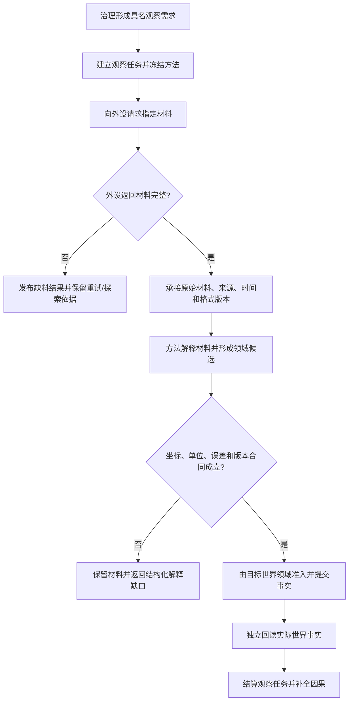

# BIZ-L1-007 外设观察材料到世界事实目标业务流程图 v0.1

## 合同

- 正式依据：4190、5090、6210、6360、8100、8210
- 输入：具名观察需求、任务和冻结方法；外设原始材料、来源、时间、坐标/位姿和格式版本
- 输出：已承接原始材料、解释结果、目标领域提交结果及独立验证结果
- 前置：观察必须来自需求和任务；外设端口只供料，不直接取得世界事实写权
- 完成：材料身份、处理方法、坐标/误差合同和目标世界事实可回查；无法解释时保持材料缺口
- 事实写入：外设材料承接事实；经目标领域准入的特征、状态、动态和世界结构事实
- 事务：原始材料承接与世界事实提交分阶段发布；后者只能引用已发布材料和冻结方法

## 节点合同

| 节点 | 业务裁决 | 目标函数组 |
| --- | --- | --- |
| A/B | 外设活动必须有需求、任务、权限和冻结方法 | `建立或复用需求任务树`、`筹办并冻结方法候选` |
| C-E | 材料有稳定来源、时间、格式和完整性结果 | `承接外设观察材料` |
| F/G | 原始向量由特征专用规则解释；空间材料要求坐标/位姿和误差预算 | `解释并提交观察事实` |
| H/I | 外设报告不是世界事实；由目标领域写入并独立读回 | `解释并提交观察事实`、`独立回读任务实际结果` |

## 关键边界与待展开项

- 旧“外设线程直接更新世界树”路径不进入目标设计。
- 相机只是 6360 的一个正式切片；目标函数需允许其它外设使用各自类型化材料，不建立无语义通用向量比较。
- L2 需按外设类型冻结材料 DTO、承接版本、超时/重复/乱序和目标领域适配器。
