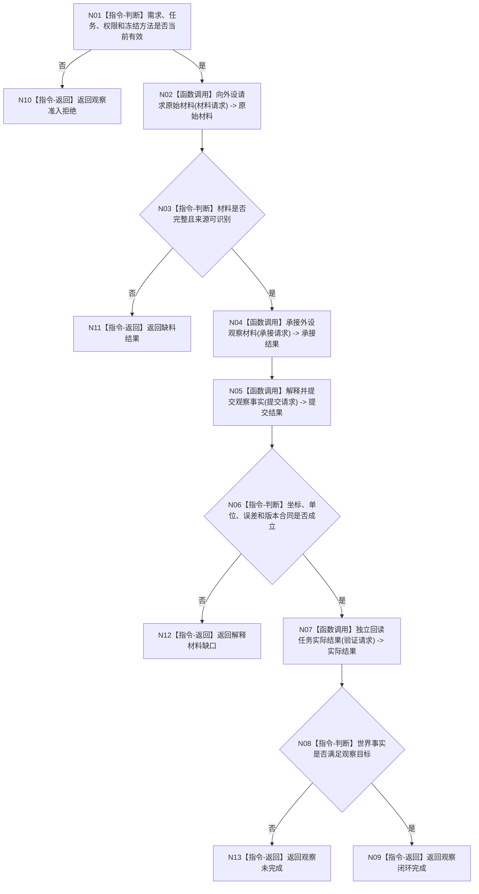

# BIZ-L1-007 外设观察材料到世界事实目标函数流程图 v0.2

更新时间：2026-08-03

## 依据

```text
4190、5090、6210、6360、8100、8210
```

## 身份与边界

正式目标函数设计图；唯一根函数执行一次有需求、有任务、有冻结方法的外设观察闭环。

## 函数合同

```text
根函数：执行一次外设观察闭环
归属模块 / 文件 / 层级：外设观察 / 海中鱼巣/领域/服务.外设观察.ixx / L1
现有或待新增：待新增
完整签名：外设观察闭环结果 外设观察服务::执行一次外设观察闭环(const 外设观察闭环请求& 请求)
参数：请求为只读借用；必须含观察任务、冻结方法、外设端口、目标事实范围和规则版本
返回结果：观察闭环结果；包含承接材料、领域提交、独立回读或缺料/解释拒绝/内部错误
被调函数流程图：承接外设观察材料、解释并提交观察事实、独立回读任务实际结果
```

## 流程图



## 节点合同

| 节点 | 类型 | 输入绑定 | 输出绑定 | 事实读写 | 验证 |
| --- | --- | --- | --- | --- | --- |
| N02 | 函数调用 | 类型化材料请求 | 原始材料 | 外设只供料 | 超时/乱序 |
| N04 | 函数调用 | 原始材料和来源 | 承接材料 | 外设材料领域 | 幂等承接 |
| N05 | 函数调用 | 承接材料和方法 | 提交结果 | 目标世界领域 | 坐标误差 |
| N07 | 函数调用 | 观察目标 | 实际结果 | 只读目标领域 | 不采信报告 |

## 关键边界

外设报告和原始向量不直接成为世界事实；外设线程不得取得世界领域写权。
