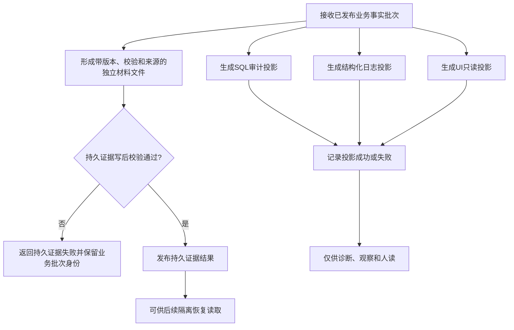

# BIZ-L1-008 持久证据与人读审计旁路目标业务流程图 v0.1

## 合同

- 正式依据：0050、4040、4200、8120、8300
- 输入：已经最后发布的业务事实批次和一致快照
- 输出：独立材料文件持久证据、SQL 审计投影、结构化日志、UI 只读投影及各自结果
- 前置：输入批次已经由事实所有者发布；旁路不得取得业务事务的写入令牌
- 完成：持久证据能校验并支持隔离恢复；审计投影可失败但不改变业务结果
- 事实写入：只有持久证据材料属于恢复证据；SQL、日志和 UI 不属于机器业务事实
- 事务：业务发布先完成；持久证据按具名策略形成；各人读投影相互独立、失败隔离

## 节点合同

| 节点 | 权威边界 | 目标函数组 |
| --- | --- | --- |
| B-D | 保存完整来源、版本、校验、格式和恢复所需材料 | `发布持久证据批次` |
| E | SQL 是可重建审计结构，不成为恢复或运行期真相 | `生成审计投影` |
| F | 日志记录决策、异常和关联身份，不承担状态机 | `生成审计投影` |
| G | UI 读取一致快照并显示，不反向修改领域事实 | `生成审计投影` |
| I | 恢复必须先读材料、隔离重建和完整验证，不能直接发布反序列化对象 | `恢复或建立运行期上下文` |

## 关键边界与待展开项

- “内存权威”描述运行期当前事实，“独立材料文件”提供跨运行恢复证据；两者不能与 SQL 投影混为一类。
- 当前 CAP-0004、CAP-0014、CAP-0045 可复用为部分审计投影候选，但它们不证明持久恢复闭环。
- L2 需冻结材料批次格式、校验算法、原子替换/追加策略、恢复选择和投影失败升级边界。
