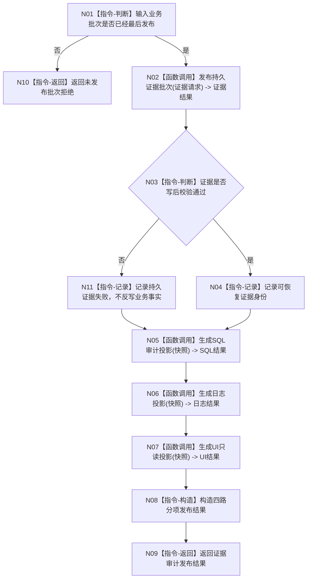

# BIZ-L1-008 持久证据与人读审计旁路目标函数流程图 v0.2

更新时间：2026-08-03

## 依据

```text
0050、4040、4200、8120、8300
```

## 身份与边界

正式目标函数设计图；唯一根函数在业务事实已经发布后形成持久证据和非权威审计投影。

## 函数合同

```text
根函数：发布持久证据与审计投影
归属模块 / 文件 / 层级：持久证据适配 / 海中鱼巣/适配/发布.业务证据与审计.ixx / L1
现有或待新增：待新增；可组合 CAP-0004、CAP-0014、CAP-0045
完整签名：证据审计发布结果 业务证据发布服务::发布持久证据与审计投影(const 证据审计发布请求& 请求)
参数：请求为只读借用；必须含已发布业务批次、一致快照、材料格式和投影策略版本
返回结果：发布结果；分别记录持久证据、SQL、日志和 UI 投影结果，不用净成功掩盖分项失败
被调函数流程图：发布持久证据批次、生成SQL审计投影、生成日志投影、生成UI只读投影
```

## 流程图



## 节点合同

| 节点 | 类型 | 输入绑定 | 输出绑定 | 事实读写 | 验证 |
| --- | --- | --- | --- | --- | --- |
| N02 | 函数调用 | 已发布批次 | 持久证据结果 | 独立材料文件 | 校验/恢复 |
| N05 | 函数调用 | 一致快照 | SQL结果 | 非权威投影 | SQL不可用 |
| N06 | 函数调用 | 一致快照 | 日志结果 | 非权威投影 | 写入失败 |
| N07 | 函数调用 | 一致快照 | UI结果 | 只读投影 | 快照版本 |

## 关键边界

内存已发布事实是运行期机器事实，独立材料文件提供恢复证据；SQL、日志和 UI 只供审计与人读，任何投影失败都不得改变业务结果。
