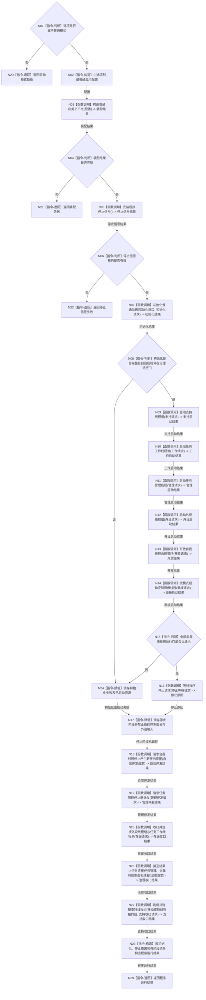

# BIZ-L1-T01 程序主线程启动协调与分阶段收口目标函数流程图 v0.1

更新时间：2026-08-03

## 依据

```text
8110、8120；目标线程归属与跨线程材料
旧鱼巢参考：流程图/鱼巢流程/20260712_旧鱼巢启动与九阶段初始化现状流程图_v0.1.md
吸收边界：只吸收初始化阶段和完整读回顺序；旧主链镜像、运行控制同步、自检/UI同入口不迁移
```

## 身份与边界

正式目标函数设计图。唯一根函数运行在程序主线程，只拥有装配、线程生命周期和停止阶段协调权，不拥有任何领域事实写入权。

## 函数合同

```text
根函数：运行普通多线程宿主
归属模块 / 文件 / 层级：程序运行宿主 / 海中鱼巣/启动.程序运行宿主.ixx / L1
现有或待新增：待新增；可复用现有停止信号和普通宿主能力
完整签名：程序运行结果 运行普通多线程宿主(const 启动选项& 选项)
参数：选项为只读借用；模式只能是普通控制面板或无窗口常驻
返回结果：程序运行结果；包含启动失败阶段、停止阶段、线程收口失败和正常停止
被调函数流程图：BIZ-L2-001-01—15；BIZ-L1-T02—T06 是并发线程入口，不是本函数的同步子流程
```

## 流程图



## 节点合同

| 节点 | 类型 | 输入绑定 | 输出绑定 | 事实读写 | 验证 |
| --- | --- | --- | --- | --- | --- |
| N02—N06 | 指令 / 函数调用 / 判断 | 普通模式选项 | 配置、上下文和停止信号租约 | 只装配并安装进程停止信号 | 配置无效、构造失败和信号部分安装恢复 |
| N07—N08 | 函数调用 / 判断 | 8120初始化端口与请求 | 一份完整初始化结果 | 领域写入只由初始化服务完成；宿主不拆写六步 | 逐阶段失败、同代次读回、治理运行门未开放 |
| N09—N15 | 函数调用 / 判断 | 同一上下文的具名启动端口 | 消费者、生产者和运行门启动结果 | 只写线程生命周期投影 | 消费者先于生产者、逐线程失败注入 |
| N16 | 函数调用 | 停止信号和程序控制邮箱 | 具名停止原因 | 无业务写入 | 信号/UI/内部故障停止 |
| N17—N27 | 指令或函数调用 | 已锁存停止阶段 | 分阶段收口结果 | 禁止新输入；允许在途结果完成领域提交 | 在途工作包、回执与邮箱排空 |
| N28 | 指令-构造 | 全部结构化结果 | 程序运行结果 | 不用日志或线程状态伪造业务结果 | 失败阶段守恒 |

## 关键边界

- 启动先由 `初始化普通系统` 严格完成 8120 六步；自我线程完成初始化后停在治理运行门，不得在任务消费者就绪前处理治理批次。随后启动支持线程、任务工作线程池、任务管理线程和外设线程组，开放自我治理，最后按模式启动控制面板线程。停止顺序遵循“先停新输入和新派发、再收口在途工作、再排空上行、最后刷新支持旁路”。
- 旧鱼巢的“数据层与世界根、语素与概念、自我锚点、核心特征、默认方法、根需求、完整读回”只按现行 8120 服务合同吸收；旧主链镜像、运行控制同步、自检线程和 UI 同入口明确排除。
- 程序主线程不得进入自我治理、任务筹办、方法执行、世界事实提交或外设解释函数。
- `join` 只证明物理线程已回收，不证明任务完成、需求满足或业务结算成功。
- 任一启动阶段失败都进入同一逆序收口路径，禁止遗留已启动线程。
