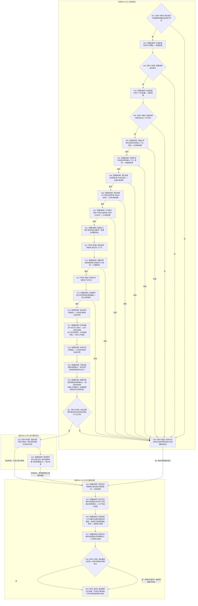

# BIZ-L1-T01 程序主线程启动协调与分阶段收口目标函数流程图 v0.3

更新时间：2026-08-26

## 依据

```text
0050、0600、8100、8110、8120
BIZ-L0-001 v0.4
BIZ-L1-T02 v0.3、T03—T06 v0.2
BIZ-L2-001-10、001-12—15
当前工作区代码：海中鱼巣/启动.应用程序.ixx
线程所有权：流程图/目标业务流程图/目标线程归属与跨线程材料.md
```

## 身份与边界

本图是唯一根函数 `运行普通程序` 的目标函数流程图，承接 BIZ-L0-001 的普通控制面板和无窗口常驻分支。它在同一函数生命周期内跨越三个上级阶段，但不把阶段名称冒充函数：

```text
BIZ-L0-01 系统启动      -> N01—N21
BIZ-L0-02 运行模块运行  -> N22—N23
BIZ-L0-03 运行模块结束  -> N24—N29及N90
BIZ-L0-04 系统结束      -> 不属于本函数；由main映射并返回退出码
```

生产运行期不属于本函数。`启动模式::生产运行期`由 `运行海中鱼巣` 分派给 `运行生产运行期`；其会话等待、停止来源、收口和结果形成尚未被8120冻结为完整生命周期合同，不能并入普通多线程宿主，也不能用当前固定失败空壳补画成功路径。

## 函数合同

```text
根函数：运行普通程序
归属模块 / 文件 / 目标分解深度：海中鱼巣.启动.应用程序 / 海中鱼巣/启动.应用程序.ixx / BIZ-L1
当前工作区完整签名：程序运行结果 运行普通程序(启动模式 模式)
参数：模式为值传递；只允许普通控制面板或无窗口常驻
返回结果：一份程序运行结果；保存模式、运行状态和失败阶段
调用方：运行海中鱼巣(const 启动选项&)
后继：返回调用方；最终由main映射进程退出码
并发线程入口：BIZ-L1-T02—T06；它们是运行模块，不是本函数的同步子流程
支持旁路：事件日志、缓存统计和持久证据等线程由BIZ-L2-001-04/15作为T01子能力启动和收口，不新增一个伪统一业务根循环
当前空壳：支持线程组、外设线程组、控制面板线程及外设/支持收口函数
```

## 流程图



## 上下级接线合同

| 上级接口 | 本图节点 | 交付给下级或并发线程 | 当前实现边界 |
| --- | --- | --- | --- |
| BIZ-L0-01 系统启动 | N01—N21 | T02先创建并停门；支持旁路先启动；运行包内部启动T03后启动T04；再启动T06、开放T02治理门并按模式启动T05 | 支持、外设、控制面板仍为空壳；不得写成真实线程已进入 |
| BIZ-L0-02 运行模块运行 | N22—N23 | T02—T06并发运行；主线程只等待进程信号、T05程序控制消息或具名致命故障 | 当前代码只调用`运行无窗口宿主`等待进程信号；程序控制邮箱和致命故障端口未接线 |
| BIZ-L0-03 运行模块结束 | N24—N29、N90 | 停新派发；停止T06新采集；T04完成/交接在途；T03/T02排空双向治理材料；T05退出；支持旁路最后刷新并连接 | 当前只显式停发、调用外设空壳、收口T04/T03和调用支持空壳；T02靠析构停止，T05没有真实租约 |
| BIZ-L0-04 系统结束 | 不适用 | 返回`运行海中鱼巣`，由入口映射退出码 | 本函数不得在返回后追加判断或业务操作 |

## 正常停止顺序与双向排空边界

- 停止阶段先关闭T03新派发和T06新采集，但不得清空已经接管的工作包、动作后槽、外设在途槽、任务结果定位、轮次结算定位或self后继决议。
- T04和T06属于生产者，先完成可完成在途工作，不能完成的材料进入具名剩余材料接管。只有生产者收口结果成立后，才进入T03/T02治理收口。
- T03到T02的显式轮次结算定位和T02到T03的self后继决议是双向链。BIZ-L2-001-14细化时必须设置共同排空屏障：两侧已停止产生新普通工作，所有已接受跨线程材料均已消费或具名接管，且两侧在途槽同时为空，才能依次连接T03和T02。
- T05只读显示不参与业务排空，但宿主必须停止其程序控制消息门、请求窗口退出并连接真实线程；无窗口模式返回明确的“无需连接”。
- 支持线程最后刷新到各自接受截止或形成同截止接管材料，再停止并连接；支持失败不得反写已成立的业务收口结果。

## 非成功与资源边界

| 位置 | 非成功 | 结果与资源处理 |
| --- | --- | --- |
| N01 | 非普通模式 | 锁存内部不一致并按空/部分租约进入共同收口；生产运行期不得误入普通路径 |
| N03/N05 | 配置或装配失败 | 锁存装配失败；无运行线程时四个收口节点按空租约组返回无需收口 |
| N06—N10 | 系统根、自我根、真实自我、四本体根或方法根失败 | 锁存对应初始化失败阶段；已经建立的上下文仍按所有权释放 |
| N13 | 自我线程创建或停门失败 | 创建函数先安全回收候选；若仍返还租约则进入共同收口 |
| N15 | 停止来源安装失败 | 锁存宿主失败；尚未启动后继模块，已取得对象仍进入共同收口 |
| N16—N21 | 任一必需启动结果失败 | 锁存初始化失败，不进入停止等待，按已取得租约执行N24—N29 |
| N23 | 停止等待内部失败或致命故障 | 保留结构化宿主结果，仍执行N24—N29 |
| N25—N27 | 任一收口非成功 | 保留未释放租约和剩余材料；原结果成功时收紧为内部不一致，不覆盖更早失败 |

## 当前工作区实现对照

| 能力 | 当前工作区事实 | 判断 |
| --- | --- | --- |
| 启动顺序骨架 | 已按支持→T03→T04→T06→T02治理门→可选T05调用 | 粗层顺序已接；支持/T06/T05仍为空壳 |
| 停止来源 | `运行无窗口宿主`只等待进程停止信号 | 部分实现；未消费T05程序控制邮箱或致命故障端口 |
| 生产者停产/排空 | 已调用T03停发、外设收口空壳和运行包T04/T03收口 | 部分实现；T06材料接管未实现，T04/T03永久失败形状未闭合 |
| T03/T02双向排空 | 当前运行包在T04后直接停止并连接T03；T02仅在作用域析构时停止 | 实现偏差；无法证明最终结算定位与self后继决议均已消费/接管 |
| T05退出/连接 | 当前没有真实控制面板线程租约 | 未实现 |
| 支持旁路收口 | `刷新并连接支持线程组()`为空函数 | 生命周期空壳 |
| 统一失败收口 | 启动线程组后的失败进入共同收口；更早初始化失败主要依赖局部析构 | 部分实现；目标要求所有已取得运行模块租约均进入结构化收口 |

## 未闭合边界

- `DRIFT-BIZ-L1-T02-STOP-WITH-PERMANENT-PROVIDER-FAILURE-UNFROZEN`、`DRIFT-BIZ-L1-T03-STOP-WITH-UNRESOLVED-GOVERNANCE-SLOT-UNFROZEN`和`DRIFT-BIZ-L1-T04-STOP-WITH-UNDELIVERED-ACTION-RESULT-UNFROZEN`继续限制故障形状下的有限时收口；本图只闭合正常路径和可具名接管路径，不能用析构、join或超时伪造这些材料已经安全交接。
- `DRIFT-BIZ-L1-PRODUCTION-RUNTIME-SESSION-LIFECYCLE-UNFROZEN`：8120只冻结`生产运行期会话::启动(请求)`及会话/上下文租约覆盖完整运行函数，没有冻结启动成功后的等待来源、正常完成条件、停止请求、在途收口、会话连接和程序运行结果矩阵；当前`运行生产运行期`固定失败。该模式已可由参数到达，但在合同补齐前不能生成诚实的独立BIZ-L1生命周期图或成功代码。

## v0.3 校正记录

- 把运行等待从当前单一进程信号空壳校正为BIZ-L2-001-10的信号、程序控制邮箱和致命故障三来源等待。
- 停止段改为BIZ-L2-001-12—15四个粗层节点，显式纳入T02、自我/T03双向材料、可选T05和支持旁路，不再依赖析构冒充正常收口。
- 所有启动失败统一携带零项/部分租约进入共同收口；空租约组返回无需收口。
- 保留当前代码的T03先于T04启动顺序，并把支持线程明确为T01下的旁路子能力，不虚构统一支持业务根循环。
- 具名登记生产运行期会话生命周期缺口；模式参数可达不等于会话生命周期已经实现。
