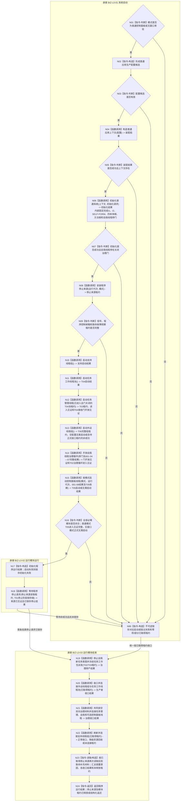

# BIZ-L1-T01 程序主线程启动协调与分阶段收口目标函数流程图 v0.4

更新时间：2026-08-27

## 依据

```text
0050、0600、8100、8110、8120 v0.10；确认稿第30项
BIZ-L0-001 v0.4
BIZ-L1-T02 v0.6、BIZ-L1-T03 v0.5、BIZ-L1-T04 v0.3、BIZ-L1-T05 v0.4、BIZ-L1-T06 v0.4
BIZ-L2-001-01—10、001-12—15
已发布代码基线：HEAD `3752fda8` 的海中鱼巣/启动.应用程序.ixx
线程所有权：流程图/目标业务流程图/目标线程归属与跨线程材料.md
```

## 身份与边界

本图是唯一根函数 `运行普通程序` 的目标函数流程图，承接 BIZ-L0-001 的普通控制面板和无窗口常驻分支。它只在 BIZ-L1 编排 BIZ-L2 根函数，不直接展开 I1、I2、SELF-FORM、四本体根、方法登记根或线程创建等 BIZ-L3 叶。

```text
BIZ-L0-01 系统启动      -> N01—N16
BIZ-L0-02 运行模块运行  -> N17—N18
BIZ-L0-03 运行模块结束  -> N19—N24及N90
BIZ-L0-04 系统结束      -> 不属于本函数；由main映射并返回退出码
```

生产运行期不属于本函数。`启动模式::生产运行期`由 `运行海中鱼巣` 分派给 `运行生产运行期`；其完整会话生命周期仍由具名 DRIFT 限制。

## 函数合同

```text
根函数：运行普通程序
归属模块 / 文件 / 目标分解深度：海中鱼巣.启动.应用程序 / 海中鱼巣/启动.应用程序.ixx / BIZ-L1
当前工作区完整签名：程序运行结果 运行普通程序(启动模式 模式)
参数：模式为值传递；只允许普通控制面板或无窗口常驻
返回结果：一份程序运行结果；保存模式、运行状态和失败阶段
调用方：运行海中鱼巣(const 启动选项&)
后继：返回调用方；最终由main映射进程退出码
并发线程入口：BIZ-L1-T02—T06；它们是运行模块，不是本函数的同步子流程
支持旁路：由BIZ-L2-001-04/15启动和收口，不新增伪统一业务根循环
```

## 流程图



## 上下级接线合同

| 上级接口 | 本图节点 | 交付给下级或并发线程 | 当前实现边界 |
| --- | --- | --- | --- |
| BIZ-L0-01 系统启动 | N01—N16 | 001-03完成初始化与T02停门；支持旁路先形成逐叶结果；再使T04消费者池关闭门进入，由001-06启动T03并开放T04门，随后启动T06；001-08以全部同代次结果开T02门并取得治理循环进入见证；001-09在普通模式取得T05内部窗口/循环进入见证，无窗口模式正式无需启动 | HEAD内联001-03子步骤，并由运行包先启动T03、后启动一个旧结果尾部线程；001-08同名函数恒真且真实开门在父函数旁路调用；001-09也只按模式返回bool，普通模式仍进入无窗口宿主；支持、T06、T05仍为空壳 |
| BIZ-L0-02 运行模块运行 | N17—N18 | T02—T06并发运行；主线程等待三类停止来源并锁存首条验真停止请求 | 当前代码只等待进程信号，未建立T01停止阶段锁存 |
| BIZ-L0-03 运行模块结束 | N19—N24、N90 | 先冻结T02新D承接意图、再冻结T03筹办/执行工作包统一派发；收口T06/T04；T03/T02共同排空；退出T05；最后收口支持旁路 | 当前代码只有T03执行请求停止锁存，未接T02意图门、统一派发边界、T02/T05结构化连接，支持和外设收口仍为空壳 |
| BIZ-L0-04 系统结束 | 不适用 | 返回`运行海中鱼巣`，由入口映射退出码 | 返回后不得追加业务判断 |

## 正常停止顺序与双向排空边界

- N18只在三类来源中锁存第一条验真通过的当前代次请求；通知消息只定位，进程信号锁存、程序控制停止锁存及其首次记录、致命故障端口必须分别正式重读并互证。同一观察批按稳定来源顺序验证。停止阶段不可撤销或倒退，后到重复保持幂等，后到更严重致命故障只补充N23最终程序结果。
- N19严格先冻结T02新具体需求D任务承接意图生产门，再冻结T03筹办/执行工作包统一派发门并使T03进入只排空阶段；不得清空已经接管的治理批次、工作包、动作后槽、结果定位、轮次结算定位或self后继决议。任一门已提交后不可回开，动态在途快照不参与阶段幂等身份。
- N20先冻结T06新采集并等待门前轮次完成发布或由外设owner合法封存；同时让T04停止领取、完成001-12冻结边界内工作，并把结果定位交给T03。每个线程只有在无剩余，或其专属owner已经给出可读恢复见证时才取得连接资格；不得建立跨外设报告、动作后槽、工作包和治理材料的通用接管包。
- N21先冻结T02/T03新的普通输入，再通知两线程在各自根循环进入同一共同排空纪元。T03必须收口已接受管理输入、主阶段治理槽、工作结果定位和待提交self材料；T02必须收口完整邮箱批次、私有处理槽、已接受结算定位和待下行材料。只有以稳定锁序或等价线性化协议锁存两侧同时为空且不会再产生反向材料的共同静止屏障，才能请求停止并连接T03/T02；T01不得逐项消费业务材料或建立通用接管owner。
- T05只读显示不参与业务排空，但其程序控制消息门必须冻结、窗口必须退出并在自身完成见证成立后独立连接；无窗口模式返回“无需连接”。T03/T02尚未取得共同静止屏障不得阻止已经完成的T05释放资源。
- 支持线程最后逐项停收并取得各自接受截止：已处理到截止、可确定重建或专属 owner 同截止收口者取得正常停止资格；EVENT 同截止快照允许形成具名日志丢失降级资格；不可舍弃材料缺 owner 时保留原材料和原租约。只有取得资格的强类型租约才进入专属停止连接；物理安全连接与正常支持收口分别记账。

## 非成功与资源边界

| 位置 | 非成功 | 结果与资源处理 |
| --- | --- | --- |
| N01/N03/N05 | 模式、配置或装配失败 | 锁存结构化失败；按空或部分租约进入共同收口 |
| N06/N07 | 初始化任一阶段失败 | 保留初始化阶段结果；自我线程候选按001-03合同安全回收或返还租约 |
| N08/N09 | 停止来源安装失败 | 尚未启动后继线程；已取得来源租约和上下文仍结构化释放 |
| N10—N16 | 任一必需启动非成功 | 不进入停止等待，按已取得租约执行N19—N24 |
| N18 | 等待内部失败、来源关闭或致命故障 | 已锁存停止仍执行全部收口；未锁存的等待失败由T01锁存宿主失败后进入相同收口 |
| N19 | 任一门、阶段或快照非成功 | 保留全部已提交/已可能提交见证；不回开T02意图门或T03派发门，后继只按已冻结边界收口 |
| N20—N22 | 任一收口非成功 | 已合格线程可以逐项连接；未合格线程保留原槽、原租约和已有专属owner见证。001-14/15均不新增通用接管owner；`前置未闭合但已安全连接`只记异常资源回收，部分连接不得冒充整体成功 |
| N23 | 停止来源补充读取非成功 | 保留首要停止原因和既有收口结果，标记补充材料不完整；不得重开或倒退停止阶段 |

## 当前工作区实现对照

| 能力 | HEAD代码事实 | 判断 |
| --- | --- | --- |
| 001-03初始化聚合 | `运行普通程序`当前内联调用I1、I2、SELF-FORM、四本体根、方法根和自我线程创建 | 归属偏差；目标要求由`初始化普通系统`唯一聚合 |
| T04/T03启动 | HEAD由`任务结果生产运行包::启动()`先启动T03，再启动一个只消费已形成结果的旧尾部线程 | 实现偏差；目标顺序为T04消费者池全部进入关闭接收门后的等待态，再启动持有该池租约的T03生产者 |
| T06启动 | `启动外设线程组()`恒返回true，`收口并连接外设线程组()`为空；D455采集器零生产调用 | 未实现；目标要求0项合法无需启动，N项逐实例独占控制域并取得进入见证后才发布完整组，半失败租约必须普通回收或交001-13正式收口 |
| T02运行门开放 | `开放自我线程治理循环()`恒返回true，父函数随后直接调用无结果`自我线程::开放治理运行门()` | 实现偏差；目标根必须消费停门及001-04—07完整结果、拥有一次性开门提交并等待治理循环进入见证；提交后非成功进入正式收口 |
| 停止来源 | 当前只安装和等待进程信号 | 部分实现；程序控制邮箱、致命故障观察端口、T01首条验真锁存和后到致命补充读取均未接线 |
| T03/T02共同排空 | 当前T04后直接停止T03，T02靠析构停止 | 实现偏差；双向材料共同排空未实现 |
| T05启动 | `按模式启动控制面板线程(启动模式)`只返回bool；普通模式随后仍调用`运行无窗口宿主` | 未实现；目标普通模式必须形成唯一T05租约和内部窗口就绪/消息循环进入见证，无窗口模式空租约无需启动 |
| 支持/T06 | 仍为空壳或无真实租约 | 未实现完整生命周期 |

## 未闭合边界

- `DRIFT-BIZ-L1-T02-STOP-WITH-PERMANENT-PROVIDER-FAILURE-UNFROZEN`、`DRIFT-BIZ-L1-T03-STOP-WITH-UNRESOLVED-GOVERNANCE-SLOT-UNFROZEN`、`DRIFT-BIZ-L1-T04-STOP-WITH-UNDELIVERED-ACTION-RESULT-UNFROZEN`继续限制永久故障形状下的有限时收口。
- `DRIFT-BIZ-L1-PRODUCTION-RUNTIME-SESSION-LIFECYCLE-UNFROZEN`继续限制生产运行期独立BIZ-L1图与成功实现。

## v0.4 校正记录

- 恢复严格分层：初始化六叶统一回到BIZ-L2-001-03，BIZ-L1不直接展开BIZ-L3。
- BIZ-L2直接子函数固定为001-01—10和001-12—15共14项；旧001-11退出。
- 001-02扩为三类停止来源安装；001-14改为T03/T02双向材料共同排空屏障。
- 001-14共同排空只负责阶段通知与进程内静止屏障；T02/T03在各自根循环完成业务，T05按自身完成见证独立连接，永久失败槽保留原租约而不交给第二owner。
- 当前代码内联初始化和合并T03/T04启动保留为实现偏差，不反向改写目标层级。

## 2026-08-27 任务工作线程池接线校正

- 8120固定自我线程停门成功后依次准备支持线程、任务工作线程池、任务管理线程和外设线程；001-06又要求消费线程池已经进入。因此N11/N12校正为先T04、后T03。
- T04全部进入时只停在关闭接收门后的等待态，不能抢跑消费；001-06取得完整池租约并证明T03进入后，必须原子开放T04接收门并把开放见证纳入N12成功结果，T03/T04才同时取得派发/接管资格。
- HEAD运行包的“先T03、后单个旧结果尾部线程”继续登记为实现偏差，不能反向覆盖目标顺序。

## 2026-08-27 外设线程组接线校正

- N13只在T03已经发布多源等待/6340外设消费见证后启动T06；线程进入见证与8110生命周期投影分账，不能用投影消息、D455打开成功或恒真空壳替代完整组成功。
- 0项外设配置合法返回无需启动；N项配置按外设稳定身份逐项建立独占控制域，全部进入后才发布一个完整组租约。
- 完整组发布前半失败必须把已进入候选全部停产。无不可舍弃在途材料者普通连接；存在未发布/未封存不可舍弃材料者把材料见证和唯一租约返还给T01，N90携带到N20的001-13正式收口，不能销毁、detach或伪装启动失败已清理。

## 2026-08-27 生产线程收口接线校正

- N20不再建立通用“剩余材料持久owner”。外设材料只认外设owner的最终报告、空槽或合法封存见证；T04动作后材料只认其专属owner恢复见证。
- T04闭合点固定为001-12冻结边界内工作已经完成，且每个工作结果定位已经交付T03；线程退出、队列为空或join均不能替代该见证。
- 收口资格逐线程裁决。已合格线程可连接；缺owner、未完成或材料未封存的线程返还原租约，不能阻塞其它独立线程安全回收，也不能被销毁或detach。

## 2026-08-27 自我治理运行门接线校正

- N14只消费阶段20停门见证与001-04—07原始完整结果：支持逐叶具名降级合法，T04/T03组合见证必须成功，T06允许正式0项无需启动；全部材料必须同运行代次。
- N14的成功终点不是裸布尔开门，而是同一首次开放身份下的门开放见证和治理循环进入见证。进入见证证明T02已经取得邮箱消费资格，不要求邮箱为空或线程先处于空闲等待。
- 门提交后不得补偿关回。已可能开放、已开放但进入超时/故障或见证矛盾都进入N90共同收口，普通应用继续持有唯一自我线程租约。

## 2026-08-27 控制面板线程启动接线校正

- N15直接消费001-08同代次成功结果和001-02程序控制提交端。无窗口常驻返回正式无需启动且不要求UI专属端口；普通模式才要求完整T05身份、只读投影、8110旁路和线程亲和窗口端口。
- 普通模式启动成功只接受T05内部“窗口已创建显示且消息循环已取得消费资格”见证；8110投影、窗口句柄、父函数bool或页面刷新均不能替代。
- 物理候选一旦创建，进入失败先按统一截止停止并连接；未连接时唯一租约随001-09失败结果进入N90/N21，禁止detach、析构joinable线程或伪装零资源失败。

## 2026-08-27 停止来源闭环校正

- `001-02`继续位于初始化成功之后，但必须早于治理运行门开放和其它运行模块启动；已经创建且停在关闭门的自我线程候选仍由初始化失败回收合同负责。
- `001-10`返回前由T01唯一锁存首条验真停止请求；等待叶只形成候选，不取得停止阶段写权。
- 程序控制来源改为非破坏性重读“停止锁存 + 首次不可变记录”；通知和消息副本均不能单独验真，跨来源异常或父级重试不得消费掉已经成立的停止候选。
- 三类停止来源租约覆盖完整收口，N23在返回前读取后到致命补充材料；后到材料只能补充最终程序结果，不能重开或倒退收口。
