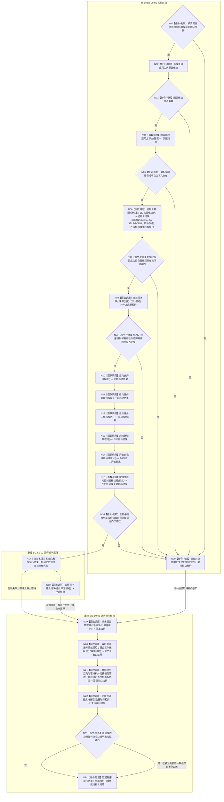

# BIZ-L1-T01 程序主线程启动协调与分阶段收口目标函数流程图 v0.4

更新时间：2026-08-26

## 依据

```text
0050、0600、8100、8110、8120 v0.10
BIZ-L0-001 v0.4
BIZ-L1-T02 v0.6、BIZ-L1-T03 v0.4、T04—T06 v0.3
BIZ-L2-001-01—10、001-12—15
当前工作区代码：海中鱼巣/启动.应用程序.ixx
线程所有权：流程图/目标业务流程图/目标线程归属与跨线程材料.md
```

## 身份与边界

本图是唯一根函数 `运行普通程序` 的目标函数流程图，承接 BIZ-L0-001 的普通控制面板和无窗口常驻分支。它只在 BIZ-L1 编排 BIZ-L2 根函数，不直接展开 I1、I2、SELF-FORM、四本体根、方法登记根或线程创建等 BIZ-L3 叶。

```text
BIZ-L0-01 系统启动      -> N01—N16
BIZ-L0-02 运行模块运行  -> N17—N18
BIZ-L0-03 运行模块结束  -> N19—N24及N90
BIZ-L0-04 系统结束      -> 不属于本函数；由main映射并返回退出码
```

生产运行期不属于本函数。`启动模式::生产运行期`由 `运行海中鱼巣` 分派给 `运行生产运行期`；其完整会话生命周期仍由具名 DRIFT 限制。

## 函数合同

```text
根函数：运行普通程序
归属模块 / 文件 / 目标分解深度：海中鱼巣.启动.应用程序 / 海中鱼巣/启动.应用程序.ixx / BIZ-L1
当前工作区完整签名：程序运行结果 运行普通程序(启动模式 模式)
参数：模式为值传递；只允许普通控制面板或无窗口常驻
返回结果：一份程序运行结果；保存模式、运行状态和失败阶段
调用方：运行海中鱼巣(const 启动选项&)
后继：返回调用方；最终由main映射进程退出码
并发线程入口：BIZ-L1-T02—T06；它们是运行模块，不是本函数的同步子流程
支持旁路：由BIZ-L2-001-04/15启动和收口，不新增伪统一业务根循环
```

## 流程图



## 上下级接线合同

| 上级接口 | 本图节点 | 交付给下级或并发线程 | 当前实现边界 |
| --- | --- | --- | --- |
| BIZ-L0-01 系统启动 | N01—N16 | 001-03完成初始化与T02停门；支持旁路先启动；再启动T03、T04、T06、开放T02治理门并按模式启动T05 | 当前代码内联001-03子步骤，并由运行包合并启动T03/T04；支持、T06、T05仍为空壳 |
| BIZ-L0-02 运行模块运行 | N17—N18 | T02—T06并发运行；主线程等待三类停止来源 | 当前代码只等待进程信号 |
| BIZ-L0-03 运行模块结束 | N19—N24、N90 | 停新派发；收口T06/T04；T03/T02共同排空；退出T05；最后收口支持旁路 | 当前代码未接T02/T05结构化连接，支持和外设收口为空壳 |
| BIZ-L0-04 系统结束 | 不适用 | 返回`运行海中鱼巣`，由入口映射退出码 | 返回后不得追加业务判断 |

## 正常停止顺序与双向排空边界

- N19只关闭T03新派发；不得清空已经接管的工作包、动作后槽、结果定位、轮次结算定位或self后继决议。
- N20先让T04/T06完成可完成在途工作，不能完成者必须进入具名剩余材料接管。
- N21先冻结T02/T03新的普通输入，再共同排空 `T03 -> T02` 轮次结算定位和 `T02 -> T03` self后继决议。只有两侧生产门已冻结、已接受材料均已消费或具名接管且两侧在途槽同时为空，才能请求停止并连接T03/T02。
- T05只读显示不参与业务排空，但其程序控制消息门必须冻结、窗口必须退出并连接；无窗口模式返回“无需连接”。
- 支持线程最后刷新到各自接受截止或形成同截止接管材料，再停止并连接。

## 非成功与资源边界

| 位置 | 非成功 | 结果与资源处理 |
| --- | --- | --- |
| N01/N03/N05 | 模式、配置或装配失败 | 锁存结构化失败；按空或部分租约进入共同收口 |
| N06/N07 | 初始化任一阶段失败 | 保留初始化阶段结果；自我线程候选按001-03合同安全回收或返还租约 |
| N08/N09 | 停止来源安装失败 | 尚未启动后继线程；已取得来源租约和上下文仍结构化释放 |
| N10—N16 | 任一必需启动非成功 | 不进入停止等待，按已取得租约执行N19—N24 |
| N18 | 等待内部失败或致命故障 | 保留结构化宿主结果，仍执行全部收口节点 |
| N20—N22 | 任一收口非成功 | 保留未释放租约和剩余材料；不覆盖更早失败 |

## 当前工作区实现对照

| 能力 | 当前工作区事实 | 判断 |
| --- | --- | --- |
| 001-03初始化聚合 | `运行普通程序`当前内联调用I1、I2、SELF-FORM、四本体根、方法根和自我线程创建 | 归属偏差；目标要求由`初始化普通系统`唯一聚合 |
| T03/T04启动 | 当前由`任务结果生产运行包::启动()`合并完成 | 可适配；目标顺序仍为T03后T04 |
| 停止来源 | 当前只安装和等待进程信号 | 部分实现；程序控制邮箱和致命故障观察端口未接线 |
| T03/T02共同排空 | 当前T04后直接停止T03，T02靠析构停止 | 实现偏差；双向材料共同排空未实现 |
| T05与支持/T06 | 仍为空壳或无真实租约 | 未实现完整生命周期 |

## 未闭合边界

- `DRIFT-BIZ-L1-T02-STOP-WITH-PERMANENT-PROVIDER-FAILURE-UNFROZEN`、`DRIFT-BIZ-L1-T03-STOP-WITH-UNRESOLVED-GOVERNANCE-SLOT-UNFROZEN`、`DRIFT-BIZ-L1-T04-STOP-WITH-UNDELIVERED-ACTION-RESULT-UNFROZEN`继续限制永久故障形状下的有限时收口。
- `DRIFT-BIZ-L1-PRODUCTION-RUNTIME-SESSION-LIFECYCLE-UNFROZEN`继续限制生产运行期独立BIZ-L1图与成功实现。

## v0.4 校正记录

- 恢复严格分层：初始化六叶统一回到BIZ-L2-001-03，BIZ-L1不直接展开BIZ-L3。
- BIZ-L2直接子函数固定为001-01—10和001-12—15共14项；旧001-11退出。
- 001-02扩为三类停止来源安装；001-14改为T03/T02双向材料共同排空屏障。
- 当前代码内联初始化和合并T03/T04启动保留为实现偏差，不反向改写目标层级。
