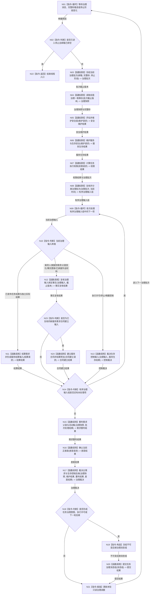

# BIZ-L1-T02 自我线程治理循环目标函数流程图 v0.1

更新时间：2026-08-03

## 依据

```text
6140—6170、8100、8200、8300、8310、8320
旧鱼巢参考：流程图/鱼巢流程/20260712_旧鱼巢自我治理循环现状流程图_v0.1.md
旧鱼巢参考：流程图/鱼巢流程/20260712_旧鱼巢动态因果结果与结算现状流程图_v0.1.md
吸收边界：保留冻结批次、优先路由、后继回灌和下一轮重判；所有正式写入改由现行领域服务完成
```

## 身份与边界

正式目标函数设计图。根函数只在自我线程运行，负责“为什么做、做哪个、优先做什么”；领域事实仍由具名领域服务提交。

## 函数合同

```text
根函数：运行治理循环
归属模块 / 文件 / 层级：自我线程 / 海中鱼巣/线程/自我线程.ixx / L1
现有或待新增：适配扩展；现有线程壳与初始化能力不等于本循环完成
完整签名：void 自我线程::运行治理循环() noexcept
参数：无显式参数；线程对象在启动前已冻结治理邮箱、只读查询、领域服务和停止阶段端口的有效引用
返回结果：void；退出原因通过线程生命周期消息和宿主收口结果表达，不以返回值写业务事实
被调函数流程图：BIZ-L2-002-01—08、BIZ-L2-003-01—04、BIZ-L2-004-01、BIZ-L2-004-06；因果学习函数留待后续 L2 批次冻结
```

## 流程图



## 节点合同

| 节点 | 类型 | 输入绑定 | 输出绑定 | 事实读写 | 验证 |
| --- | --- | --- | --- | --- | --- |
| N03 | 函数调用 | 邮箱、时间源和停止阶段 | 值式治理批次、截止版本和完整秒 | 锁内只批量取出或构造材料 | 空邮箱、批次边界、迟到和停止唤醒 |
| N04 | 函数调用 | 批次截止版本 | 同代次快照 | 只读 | 跨代次拒绝 |
| N05—N07 | 函数调用 | 快照和完整秒 | 值式维护/权限结果 | 只由领域服务提交；循环次数不参与数值 | 零秒、多秒和幂等 |
| N08—N14 | 函数调用 / 循环 / 判断 | 冻结批次和一致事实 | 有序批次处理结果 | 领域调用均在队列锁外；保持邮箱已冻结顺序，不二次排序 | 协议复核、父链变化、控制输入和批次穷尽 |
| N11 | 函数调用 | 独立实际结果 | 任务结论、需求结论和可选服务聚合输入 | 只由任务 / 需求领域提交；不写服务值 | 重试不重复结算 |
| N24 | 函数调用 | 已复核新人类服务需求、法规准入和生存控制态 | 唯一合同、预算和30%预支结果 | 服务合同与预支独立原子事务 | 有效期内唯一、30%一次、A=0拒绝 |
| N15 | 函数调用 | 当前需求事实、父链和批次结果 | 活动集与父链重判结果 | 只由需求领域提交 | 单项子结果回流、历史子项和循环拒绝 |
| N19/N20 | 指令/函数调用 | 治理裁决 | 不可变后继消息组/提交结果 | 消息不是任务事实 | 队列满、停止和同批幂等 |

## 关键边界

- 自我线程不直接写任务状态、方法选择、世界事实、安全值、服务值或合同。
- 一次循环先冻结一个治理批次；同批消息按正式优先级处理，迟到消息进入下一批，不得在处理过程中改变本批截止版本。
- 邮箱在提交阶段已经稳定排序；治理循环只复核并分类冻结批次，不建立第二套优先级排序权威。
- 一次批次最多调用一次维护入口，但数值只按完整单调秒和正式事件变化。
- 任务回执不能直接触发结算；必须先取得任务管理线程提供的独立实际回读材料。
- 任务 / 需求结算只形成服务生存聚合输入；70%余款或准备补回不得在本批另行发布，而由后续 `维护服务与生存安全` 与衰减和安全根回归共同原子发布。
- 新服务合同与30%预支可以独立原子发布，但人类请求或预支本身不直接改变生存安全根值。
- 旧鱼巢的“后继回灌”改写为不可变消息组；只把上一批正式结果带入下一批，不复制线程内可变状态或第二份业务事实。
- 队列锁内只允许取出/提交不可变材料，所有领域函数均在锁外调用。
