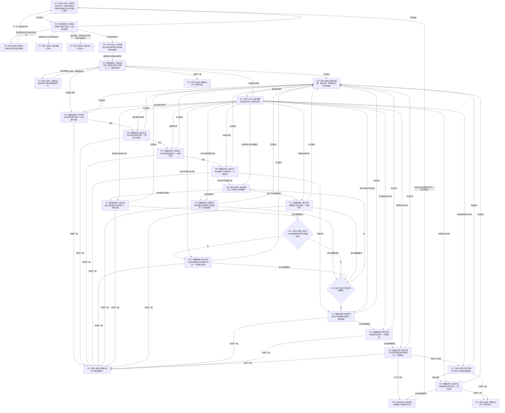

# BIZ-L1-T02 自我线程治理循环目标函数流程图 v0.2

更新时间：2026-08-15

## 依据

```text
0050 v1.3、4050、8100、8110、8200
BIZ-MAIN-001 v0.2
BIZ-L2-002-01 v0.2、BIZ-L2-002-02—08、BIZ-L2-003-01—04、BIZ-L2-004-01、BIZ-L2-004-06
RUNTIME-GOVERNANCE-CURRENT-BATCH-ASSEMBLY v0.1
当前代码：自我线程私有持有唯一治理邮箱；普通应用尚未持有自我线程或完整 T02 provider 组
```

## 身份与边界

正式目标函数设计图。根函数在自我物理线程的治理运行门开放后执行，负责从一个完整治理批次出发完成本轮业务编排，并返回结构化退出结果。它不直接写 DATA-L1—L3，不把消息、线程生命周期投影、循环次数或等待时长当作机器业务事实。

```text
前置：自我线程、唯一治理邮箱和唯一自我治理批次路由已构造；治理运行门已经正式开放
输入：无显式参数；只消费自我线程运行上下文中冻结的路由和具名 BIZ 领域服务借用
输出：自我治理循环退出结果；线程入口把该值式结果保存为内部完成材料
正常完成：批次路由在无待完成批次时正式返回邮箱已停止
非目标：普通应用装配、provider 实现、DATA 直达、跨进程恢复、完整停机阶段机和全循环代码施工
```

## 函数合同

```text
根函数：运行治理循环
归属模块 / 文件 / 层级：自我线程 / 海中鱼巣/线程/创建.自我线程.ixx / BIZ-L1
现有或待新增：待扩展；当前线程入口在运行门开放后立即锁存停止，尚无治理循环
预冻结签名：自我治理循环退出结果 自我线程::运行治理循环() noexcept
参数：无显式参数；对象私有持有唯一邮箱和唯一批次路由，稳定借用的 provider 生命周期覆盖线程
返回结果：邮箱已停止、批次组合终止、一致事实终止、领域治理终止、下行提交终止或内部不一致；不得只靠生命周期消息表达
被调函数流程图：BIZ-L2-002-01—08、BIZ-L2-003-01—04、BIZ-L2-004-01、BIZ-L2-004-06
```

## 流程图



## 节点合同

| 节点 | 类型 | 参数 / 输入绑定 | 结果 / 输出绑定 | 事实读写 | 后继条件 | 验证 |
| --- | --- | --- | --- | --- | --- | --- |
| N01—N03 | 指令 / 函数调用 | 路由固定配置、最后成功见证、可选原待重试见证 | 结构化批次组合结果 | 邮箱批次由路由唯一取出；父循环零直达邮箱 | 只按结果状态分流 | 重试零再次读邮箱、同一见证不改绑 |
| N02A | 指令-提交 | 完整值式批次 | 当前治理批次处理槽 | 线程私有运行材料，不是业务事实 | 接管完成才调用后继 | 后继任意失败批次仍可读回 |
| N04/N24 | 函数调用 / 等待 | 已冻结批次的单一共享事实截止 | 同截止一致事实快照 | 只读 BIZ 包装；零 DATA-L1 直达 | 同批重读或终止 | G0/G1 与全部子快照截止一致 |
| N05—N08 | 函数调用 | 同一批次与一致快照 | 值式维护、权限和分类结果 | 只由具名领域服务提交 | 每入口本批至多一次 | 完整秒不取自循环次数 |
| N09—N13 | 循环 / 函数调用 | 保持冻结顺序的强类型输入 | 逐项值式结果 | 锁外领域调用 | 批次穷尽 | 不建立第二排序权威 |
| N14—N18 | 函数调用 / 构造 | 本批结果与当前一致事实 | 重判、差距、治理裁决和消息组 | 消息不是任务事实 | 提交成功或结构化终止 | 不完整候选零发布 |
| N20 | 指令-提交 | 本轮全部成功材料 | 后继请求游标并清空处理槽 | 只更新线程私有运行见证 | 下一轮 | 所有可能失败操作均在清槽前完成 |
| N28/N29 | 指令-赋值 / 分派 | 槽内阶段、原幂等请求和已成功结果 | 首个未完成步骤 | 零邮箱读取、零重复成功写 | 合法重试 | 成功步骤不重复，失败步骤同请求恢复 |
| N22—N27 | 指令-返回 | 具名结构化结果 | 自我治理循环退出结果 | 零补造事实 | 线程入口保存后收口 | 生命周期投影不替代内部结果 |

## 所有权与停止边界

1. 唯一 `自我线程`对象私有持有唯一 `有界自我治理邮箱`和唯一 `自我治理批次路由`；路由不可复制、不可移动，并是该邮箱唯一冻结消费者。
2. 普通应用持有完整秒服务和运行期事实版本服务；构造自我线程运行上下文时只交付稳定借用，provider 与生命周期端口均晚于自我线程析构。
3. 路由必须在物理自我线程启动前、邮箱首次冻结前构造。当前创建候选尚未具备三个 provider 的最终装配，故本图不授权代码施工。
4. 停止不再传递“停止阶段版本”。正常退出只由路由在待完成槽为空后返回邮箱正式 `已停止`；已取出批次即使收到停止也必须先补证并交付。
5. 路由交付成功后，父循环立即把完整批次接管到自己的当前处理槽；后继失败不得让批次随栈退出销毁。槽保存当前阶段、原幂等请求和已完成结果，恢复只从首个未完成步骤继续。
6. 可重试失败保留同一批次和见证；等待策略只影响调度，不改变批次身份、顺序或事实。永久 provider 失败下的优雅停机时限属于后继停机设计，本切片保持 `NOT_RUN`，但任何实现都不得丢弃待完成批次。

## 关键边界

- v0.2 正式替代并删除 v0.1；旧 `冻结当前治理批次(邮箱, 完整秒, 停止阶段)`不得恢复。
- `自我治理循环退出结果`及各下层 DTO 的精确 C++ 字段、枚举数值和模块导出，在对应提供者最终发布后机械匹配；本图冻结语义与分支，不冒充当前 ABI。
- T02 不直达 DATA-L1—L3。所需基础数据能力只通过已登记的具名 BIZ / DATA 聚合服务消费合同取得。
- 本图只完成父目标重基线。普通应用运行上下文装配、T02 首段真实接线、L2-002-03 重基线、全循环施工、构建和动态验收均为后继 `NOT_RUN`。
