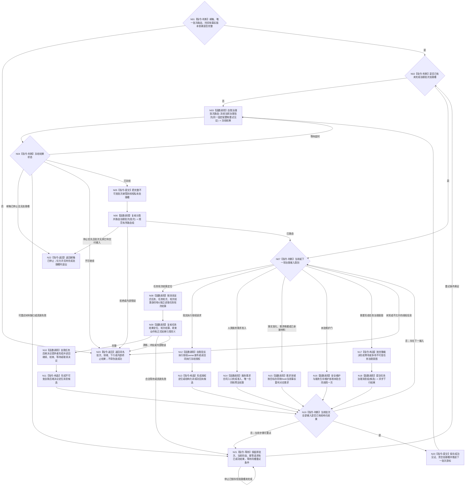

# BIZ-L1-T02 自我线程治理循环目标函数流程图 v0.3

更新时间：2026-08-26

## 依据

```text
0050、4050、8100、8110、8200、8300
BIZ-L0-001 v0.4
BIZ-L1-T01 v0.4
BIZ-MAIN-001 v0.2
当前工作区代码：海中鱼巣/线程/创建.自我线程.ixx
```

## 身份与边界

本图只冻结自我物理线程在治理运行门开放后的根循环。它是 BIZ-L0-02 中的一个并发运行模块：对象、邮箱、路由和线程由 T01 在 BIZ-L0-01 建立；T01 进入 BIZ-L0-03 后停止并连接该线程。

自我线程负责读取、比较、编排和形成不可变治理意图，不拥有任务状态、方法选择、执行冻结、任务结果、需求结论、安全值或服务值的第二写入权。具体事实只由对应领域 owner 的公开入口发布和独立读回。

## 函数合同

```text
根函数：运行治理循环
归属模块 / 文件 / 目标分解深度：海中鱼巣.线程.创建.自我线程 / 海中鱼巣/线程/创建.自我线程.ixx / BIZ-L1
完整身份：海中鱼巣::自我线程::运行治理循环
当前工作区签名：自我治理循环退出结果 运行治理循环() noexcept
可见性：自我线程私有成员；只由同对象线程入口在治理运行门开放后调用
参数：无显式参数；消费构造时冻结的邮箱、批次路由、时间、事实版本和具名服务借用
返回结果：结构化自我治理循环退出结果；线程入口随后形成物理退出见证
上级前置：T01已经取得停门见证并正式开放治理运行门
上级后继：返回线程入口；T01在BIZ-L0-03等待线程结束
```

## 流程图



## 输入类别与唯一后继

| 输入类别 | 自我线程职责 | 唯一事实 owner / 后继 | 禁止行为 |
| --- | --- | --- | --- |
| 任务轮次结算定位 | 按显式 T、R、结算身份和 G 独立读回，形成 self 后继决议 | 任务 owner 提供轮次结算；自我后继决议 owner 发布决议 | 不从任务结果直接写需求满足，不按任务猜结算身份，不自动生成下一筹办 |
| 现实执行授权请求 | 编排自我业务 owner 发布或读回授权 | 自我现实执行授权 owner | 线程布尔值、消息或安全结果不得代替授权事实 |
| 人类服务需求 | 调用唯一合同准入与预支入口 | 服务合同 owner、需求 owner | 不绕过合同准入，不重复预支 |
| 事实变化、需求唤醒、已承接材料 | 按对应目标合同 fresh 重判 | 需求、任务或材料承接 owner | 不把外设报告、缓存或旧结果直接当需求结论 |
| 安全与服务维护 | 每个完整治理批次按合同各调用一次 | 安全与服务领域 owner | 循环次数、超时或消息数不成为数值变化量 |
| 任务治理意图 | 形成不可变值式候选并异步交给任务管理 | T03独立取出、复核并调用任务 owner | 自我线程不直接写任务状态、方法选择或执行冻结 |
| 线程生命周期信息 | 不进入治理业务输入 | 控制面板只读投影 / 支持旁路 | 不将线程运行、阻塞或退出解释为业务事实 |

## 停止与重试合同

- 停止请求不得抛弃已经从邮箱冻结并接管的治理批次。存在处理槽时必须保留原批次、阶段、幂等请求及已成功结果，直到完成交付或形成结构化不可恢复终止。
- 只有邮箱已经停止且当前没有待完成处理槽时，根循环才返回 `邮箱已停止`。
- 合法等待和资源失败只恢复首个未完成步骤，不重新读取邮箱、不改绑身份、不重复已成功写入。
- 根循环返回后，线程入口只保存运行结果并发布物理退出见证；生命周期投影不能替代内部退出结果或业务终态。

## 当前工作区实现对照

| 能力 | 当前工作区事实 | 判断 |
| --- | --- | --- |
| 运行门后进入根循环 | 线程入口在运行门开放后调用 `运行治理循环()` | 已接线 |
| 唯一邮箱、批次路由、完整秒和事实版本 | 自我线程对象私有构造并持有 | 已接线，但部分配置仍固定为运行代次/版本1 |
| 批次冻结与规范路由 | 已调用真实批次路由 | 已接线 |
| 任务结果窄路径 | 已保存处理槽，并按显式任务、轮次、结算身份和G读取轮次结算 | 部分实现 |
| self后继决议 | 当前只形成“任务目标已达成/未达成”裁决并立即退出 | 实现偏差；尚未形成继续/结束/等待/取消正式决议 |
| 普通治理输入 | 当前路由后没有正式消费，通常返回 `领域治理终止` | 实现缺失 |
| 安全、服务、权限及一致事实 | 仍包含骨架入口或材料缺失收口 | 不能宣称真实维护闭环 |
| 停止期间保槽 | 循环顶部和同槽等待分支遇到停止会直接返回 `邮箱已停止` | 实现偏差；可能跳过未完成处理槽交付 |
| 线程入口保存循环结果 | 当前调用后丢弃返回值，只发布生命周期并标记完成 | 实现缺失；结构化退出结果未成为可读内部完成材料 |

## 关键边界

- 任务结果只是任务执行及状态变化的引用，不是容量、分配物或需求满足结论。
- 有明确上级调用任务的结果可由任务域完成该调用边结算；其它关联任务或需求只在自己实际使用时 fresh 读取当前状态并独立核算。
- 优先级只决定任务和方法获得执行机会的次序，不决定需求满足、结果归属或 self 后继。
- T02 是编排载体，不直达 ARCH-L1；ARCH-L2/ARCH-L4 事实只经具名公开服务消费。
- 当前工作区实现和本图目标仍有具名差异；本图校正不等于代码、构建、运行或自我治理闭环完成。

## 未闭合的上层停机接口

`DRIFT-BIZ-L1-T02-STOP-WITH-PERMANENT-PROVIDER-FAILURE-UNFROZEN`：当前材料要求已接管批次在停止时不得丢弃，但没有冻结永久 provider 失败下的持久交接 owner、可恢复见证、允许终止条件或超时合同。N21 因此只能保槽等待，不能自行改成丢批次、假成功或裸超时退出。该缺口不改变 T02 的线程所有权和普通成功路径，但在裁决前不能宣称 BIZ-L0-03 对这一故障形状具备必然有限时收口。

## v0.3 校正记录

- 接入 T01 v0.2：只在治理运行门开放后进入，属于 BIZ-L0-02；结束由 BIZ-L0-03 收口。
- 删除旧“任务结果直接进入结果消费分配/同步需求结算”链，改为任务轮次结算显式读回和 self 后继决议。
- 冻结延后结算边界：其它关联需求或任务在自身使用时 fresh 核算，不在本批分配任务结果。
- 将现实执行授权、服务需求、事实唤醒、安全/服务维护和任务治理意图恢复为并列强类型输入类别。
- 依据当前工作区登记任务结果窄路径、普通输入、停止保槽和退出结果保存的实现差异，不把 WIP 冒充已发布能力。
